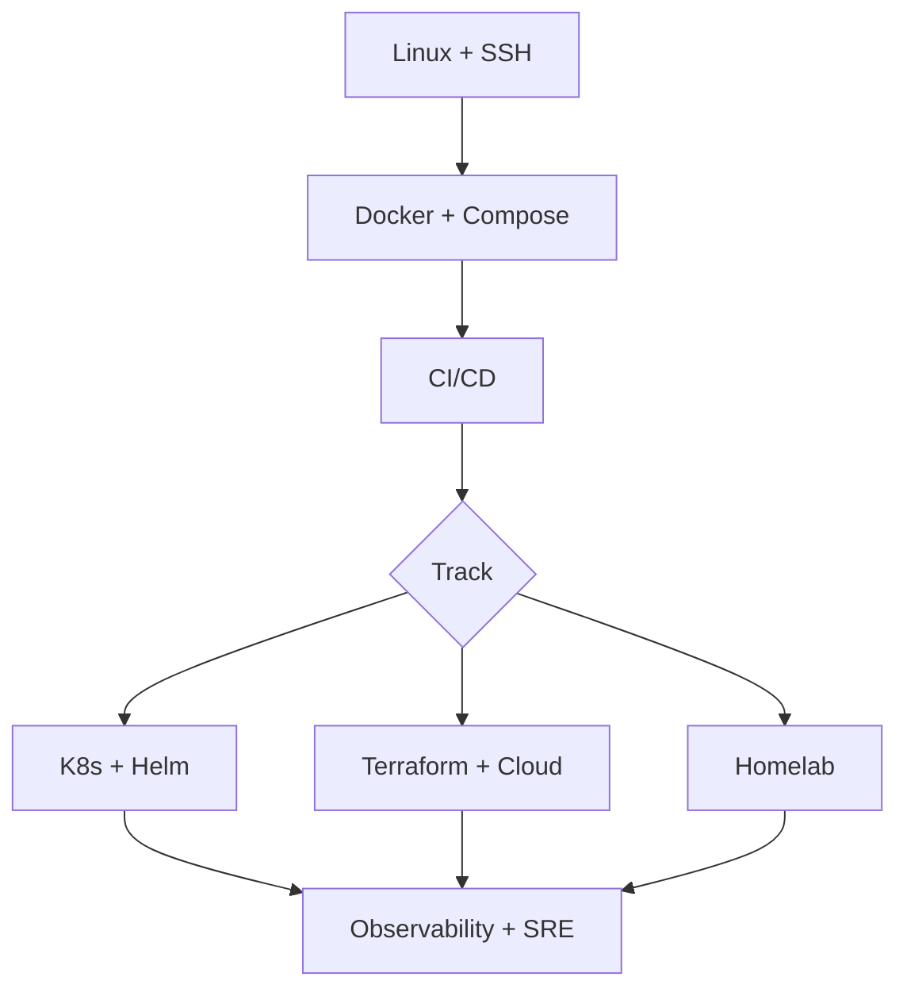
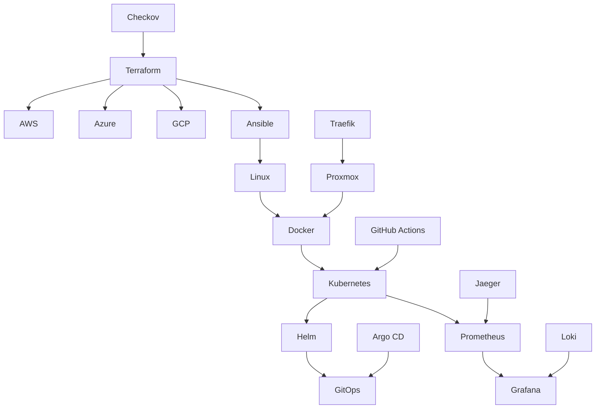

# ☁️ Awesome DevOps & Cloud

**A curated guide to Linux, containers, infrastructure as code, CI/CD, cloud platforms, observability, and self-hosting.**

*Part of the [Awesome Resources](https://github.com/kirtiramchandani/awesome-resources) ecosystem — ship reliably, operate confidently.*

[Start Here](#-start-here) · [Top 50](#-top-50-must-have-resources) · [Kubernetes](#-kubernetes--orchestration) · [90-Day Plan](#-90-day-learning-plan)

---

## ✨ What Is This?

**Awesome DevOps & Cloud** collects materials for building, deploying, and operating software — Linux, containers, orchestration, IaC, CI/CD, cloud docs, SRE, monitoring, and homelab self-hosting.

> **Automate the boring parts. Observe everything. Design for failure.**
---

## 📋 Table of Contents

- [Start Here](#-start-here)
- [Why DevOps & Cloud](#-why-devops--cloud)
- [Learning Path](#-learning-path)
- [Top 50 Must-Have Resources](#-top-50-must-have-resources)
- [90-Day Learning Plan](#-90-day-learning-plan)
- [Ecosystem Map](#-ecosystem-map)
- [Linux](#-linux)
- [Docker & Containers](#-docker--containers)
- [Kubernetes & Orchestration](#-kubernetes--orchestration)
- [Infrastructure as Code](#-infrastructure-as-code)
- [CI/CD & GitHub Actions](#-cicd--github-actions)
- [Ansible & Configuration Management](#-ansible--configuration-management)
- [AWS](#-aws)
- [Azure](#-azure)
- [Google Cloud (GCP)](#-google-cloud-gcp)
- [Site Reliability Engineering (SRE)](#-site-reliability-engineering-sre)
- [Monitoring & Observability](#-monitoring--observability)
- [Homelab & Self-Hosting](#-homelab--self-hosting)
- [Cheat Sheets](#-cheat-sheets--quick-references)
- [Interview Prep](#-interview-prep)
- [Case Studies & Hands-On Labs](#-case-studies--hands-on-labs)
- [Project Ideas (30+)](#-project-ideas-30)
- [Contributing](#-contributing)
- [License](#-license)
---

## 🚀 Start Here

| If you are… | Start with | Why |
| --- | --- | --- |
| 🆕 **New to Linux** | [Linux](#-linux) → Docker | Shell fluency unlocks everything else |
| ☸️ **Learning Kubernetes** | [Kubernetes](#-kubernetes--orchestration) | Orchestration for distributed workloads |
| 🏗️ **Managing cloud infra** | [IaC](#-infrastructure-as-code) | Reproducible environments beat click-ops |
| 🏠 **Building a homelab** | [Homelab](#-homelab--self-hosting) | Learn production concepts on hardware you control |
| 🎤 **Interview prep** | [Top 50](#-top-50-must-have-resources) → Interview Prep | Anchors hiring managers expect |
---

## ☁️ Why DevOps & Cloud

| Strength | What it means |
| --- | --- |
| **Repeatability** | IaC and CI/CD rebuild environments from code |
| **Scalability** | Cloud and K8s scale horizontally when traffic spikes |
| **Resilience** | Health checks and multi-AZ design reduce failures |
| **Visibility** | Metrics, logs, and traces shorten incident recovery |
---

## 🛤️ Learning Path

---

## 🏆 Top 50 Must-Have Resources

The essentials if you read nothing else. Ordered roughly by learning sequence.

| # | Resource | Category | Level | Why | Tags |
| --- | --- | --- | --- | --- | --- |
| 1 | [Linux Journey](https://linuxjourney.com/) | Linux | Beginner | Friendly interactive tour of shell, permissions, and processes. | 🟢 🆓 🛠 ⭐ |
| 2 | [Docker Documentation](https://docs.docker.com/) | Containers | Beginner | Official path from images through Compose and networking. | 🟢 🆓 🌐 ⭐ 🔥 |
| 3 | [Kubernetes Documentation](https://kubernetes.io/docs/home/) | Kubernetes | Intermediate | Canonical K8s concepts — pods, services, deployments. | 🟡 🆓 🌐 ⭐ 🔥 |
| 4 | [Terraform Documentation](https://developer.hashicorp.com/terraform/docs) | IaC | Intermediate | Infrastructure as code with state, modules, and providers. | 🟡 🆓 🌐 ⭐ 🔥 |
| 5 | [GitHub Actions Docs](https://docs.github.com/en/actions) | CI/CD | Beginner | Workflow automation integrated with GitHub repos. | 🟢 🆓 🌐 ⭐ |
| 6 | [AWS Documentation](https://docs.aws.amazon.com/) | Cloud | Intermediate | Primary hyperscaler reference for EC2, S3, IAM, and more. | 🟡 🆓 🌐 ⭐ |
| 7 | [Prometheus Docs](https://prometheus.io/docs/introduction/overview/) | Observability | Intermediate | Metrics collection and PromQL for alerting. | 🟡 🆓 🌐 ⭐ |
| 8 | [Grafana Documentation](https://grafana.com/docs/grafana/latest/) | Observability | Intermediate | Dashboards and visualization atop metrics and logs. | 🟡 🆓 🌐 ⭐ |
| 9 | [Google SRE Book](https://sre.google/sre-book/table-of-contents/) | SRE | Advanced | Free foundational text on reliability engineering. | 🔴 🆓 📘 ⭐ |
| 10 | [Helm Documentation](https://helm.sh/docs/) | Kubernetes | Intermediate | Package manager templating K8s manifests. | 🟡 🆓 🌐 ⭐ |
| 11 | [Ansible Documentation](https://docs.ansible.com/) | Automation | Intermediate | Agentless configuration management playbooks. | 🟡 🆓 🌐 |
| 12 | [Azure Documentation](https://learn.microsoft.com/en-us/azure/) | Cloud | Intermediate | Microsoft cloud services and identity integration. | 🟡 🆓 🌐 ⭐ |
| 13 | [Google Cloud Docs](https://cloud.google.com/docs) | Cloud | Intermediate | GCP services including GKE and Cloud Run. | 🟡 🆓 🌐 ⭐ |
| 14 | [k3s](https://docs.k3s.io/) | Kubernetes | Intermediate | Lightweight K8s ideal for homelab and edge. | 🟡 📦 🛠 ⭐ |
| 15 | [Proxmox VE](https://pve.proxmox.com/wiki/Main_Page) | Homelab | Intermediate | Type-1 hypervisor for home virtualization. | 🟡 📦 🛠 ⭐ |
| 16 | [Traefik](https://doc.traefik.io/traefik/) | Networking | Intermediate | Dynamic reverse proxy with automatic TLS. | 🟡 📦 🛠 ⭐ |
| 17 | [Argo CD](https://argo-cd.readthedocs.io/) | GitOps | Advanced | Declarative continuous delivery for Kubernetes. | 🔴 📦 🛠 ⭐ |
| 18 | [OpenTofu](https://opentofu.org/docs/) | IaC | Intermediate | Open-source Terraform fork with compatible workflow. | 🟡 📦 🌐 |
| 19 | [CNCF Landscape](https://landscape.cncf.io/) | Reference | All | Map of cloud native projects and maturity. | 🟢 🌐 ⭐ |
| 20 | [The Phoenix Project](https://itrevolution.com/product/the-phoenix-project/) | Book | Beginner | DevOps culture novel illustrating flow and feedback. | 🟢 💰 📘 ⭐ |
| 21 | [tldr pages](https://tldr.sh/) | Linux | Beginner | Practical command examples without full man pages. | 🟢 📦 🛠 🔥 |
| 22 | [Brendan Gregg Linux Perf](http://www.brendangregg.com/linuxperf.html) | Linux | Advanced | Production performance troubleshooting methodology. | 🔴 🆓 📘 ⭐ |
| 23 | [Nginx Documentation](https://nginx.org/en/docs/) | Networking | Intermediate | Web server and reverse proxy configuration. | 🟡 🆓 🌐 |
| 24 | [Certbot](https://certbot.eff.org/) | TLS | Beginner | Automated Let's Encrypt certificate issuance. | 🟢 🆓 🛠 ⭐ |
| 25 | [Restic](https://restic.net/) | Backup | Intermediate | Encrypted deduplicated backups to many backends. | 🟡 📦 🛠 ⭐ |
| 26 | [Tailscale](https://tailscale.com/kb/) | Networking | Beginner | WireGuard mesh VPN for homelab access. | 🟢 🛠 🛡 |
| 27 | [Loki](https://grafana.com/docs/loki/latest/) | Observability | Advanced | Log aggregation designed for Grafana stack. | 🔴 🆓 🌐 |
| 28 | [Jaeger](https://www.jaegertracing.io/docs/) | Observability | Advanced | Distributed tracing for microservices. | 🔴 🆓 🌐 |
| 29 | [Checkov](https://www.checkov.io/) | Security | Intermediate | IaC static analysis for Terraform and K8s. | 🟡 📦 🛡 |
| 30 | [Pulumi](https://www.pulumi.com/docs/) | IaC | Intermediate | IaC using general-purpose programming languages. | 🟡 🆓 🌐 |
| 31 | [kind](https://kind.sigs.k8s.io/) | Kubernetes | Intermediate | K8s in Docker for local development clusters. | 🟡 📦 🛠 |
| 32 | [Minikube](https://minikube.sigs.k8s.io/docs/) | Kubernetes | Beginner | Local single-node K8s for learning. | 🟢 📦 🛠 ⭐ |
| 33 | [AWS Well-Architected](https://aws.amazon.com/architecture/well-architected/) | Cloud | Advanced | Framework for secure, reliable, efficient cloud workloads. | 🔴 🆓 🌐 ⭐ |
| 34 | [DigitalOcean Tutorials](https://www.digitalocean.com/community/tutorials) | Tutorials | Beginner | Step-by-step Linux and Docker guides. | 🟢 🆓 🛠 |
| 35 | [Homelab subreddit wiki](https://www.reddit.com/r/homelab/wiki/index/) | Community | Beginner | Community homelab hardware and setup guides. | 🟢 🔥 |
| 36 | [Linux Foundation Training](https://training.linuxfoundation.org/) | Courses | Intermediate | Official CKA and cloud native certification prep. | 🟡 💰 🌐 ⭐ |
| 37 | [KodeKloud](https://kodekloud.com/) | Courses | Intermediate | Hands-on labs for K8s, Terraform, and CI/CD. | 🟡 💰 🛠 🔥 |
| 38 | [awesome-cybersecurity](https://github.com/kirtiramchandani/awesome-cybersecurity) | Security | All | Sibling list for hardening and secure operations. | 🟢 ⭐ |
| 39 | [90-Day Plan](#-90-day-learning-plan) | Planning | All | Structured quarter with weekly deliverables. | 🟢 ⭐ |
| 40 | [Case Studies & Labs](#-case-studies--hands-on-labs) | Labs | All | Thirty-plus infrastructure projects. | 🟢 🚀 ⭐ |
| 41 | [Compose Specification](https://docs.docker.com/compose/compose-file/) | Containers | Intermediate | Multi-container local stack definition standard. | 🟡 🆓 🌐 |
| 42 | [Flux CD](https://fluxcd.io/flux/) | GitOps | Advanced | GitOps operator alternative to Argo CD. | 🔴 📦 🛠 |
| 43 | [Vault](https://developer.hashicorp.com/vault/docs) | Secrets | Advanced | Secrets management and dynamic credentials. | 🔴 🆓 🌐 ⭐ |
| 44 | [Crossplane](https://docs.crossplane.io/) | IaC | Advanced | Kubernetes-native control plane for cloud resources. | 🔴 📦 🌐 |
| 45 | [Cilium](https://docs.cilium.io/) | Networking | Advanced | eBPF-based K8s networking and observability. | 🔴 📦 🛠 |
| 46 | [Infracost](https://www.infracost.io/docs/) | FinOps | Intermediate | Terraform cost estimates in CI. | 🟡 📦 |
| 47 | [Uptime Kuma](https://github.com/louislam/uptime-kuma) | Monitoring | Beginner | Self-hosted uptime monitoring dashboard. | 🟢 📦 🛠 🔥 |
| 48 | [Portainer](https://docs.portainer.io/) | Homelab | Beginner | Docker and K8s GUI for homelab management. | 🟢 📦 🛠 |
| 49 | [Awesome Resources Hub](https://github.com/kirtiramchandani/awesome-resources) | Hub | All | Navigate all sibling awesome lists. | 🟢 ⭐ |
| 50 | [Interview Prep](#-interview-prep) | Career | All | Platform and cloud role interview resources. | 🟢 ⭐ |
---

## 📅 90-Day Learning Plan

| Week | Theme | Deliverable |
| --- | --- | --- |
| 1 | Linux & shell | Bash script + SSH hardening on VM |
| 2 | Git + networking | Branch workflow doc + DNS/TLS notes |
| 3 | Docker | Multi-stage Dockerfile + Compose stack |
| 4 | CI/CD | GitHub Actions pipeline green on main |
| 5 | Terraform | VPC or storage with remote state |
| 6 | Cloud deep dive | Three-tier or serverless on AWS/Azure/GCP |
| 7 | Kubernetes | Deployment + Service + Ingress on k3s |
| 8 | Helm + GitOps | Custom chart or Argo CD sync |
| 9 | Observability | Prometheus/Grafana dashboard + alert |
| 10 | Security + secrets | IAM least privilege + secret manager |
| 11 | Homelab capstone | Two self-hosted services with TLS |
| 12–13 | Portfolio + interviews | Architecture write-up + mock whiteboard |
### Weekly focus (Days 1–7 each week)

| Week | Mon–Tue | Wed–Thu | Fri–Sun | Checkpoint |
| --- | --- | --- | --- | --- |
| 1 | Users, groups, permissions | systemd units & journals | SSH keys + sudo audit | Script automates three admin tasks |
| 2 | Git branching & reviews | DNS, TLS, curl debugging | Draw network path for a web request | Doc explains your home lab DNS |
| 3 | Images, volumes, networks | Compose multi-service stack | Scan image with dive or trivy | Push image to registry |
| 4 | Workflow triggers & caches | Matrix builds & artifacts | Deploy to staging from main | Green pipeline badge in README |
| 5 | Modules & remote state | Workspaces or directories | Policy check in CI | Destroy/recreate infra safely |
| 6 | Identity & networking lab | Managed service hands-on | Cost estimate documented | Architecture diagram checked in |
| 7 | Deployments & services | Ingress & cert-manager | Backup etcd or cluster state | Rollback tested deliberately |
| 8 | Helm templating | GitOps sync & drift | Observability for releases | Chart published internally |
| 9 | Metrics & dashboards | Log queries & traces | Alert runbook written | Page yourself once intentionally |
| 10 | Secrets & rotation | IAM or RBAC review | CIS or STIG spot checks | No long-lived keys in repos |
| 11 | Reverse proxy & TLS | Second service integrated | Off-site backup tested | Uptime checks green one week |
| 12 | Portfolio narrative | Mock SRE interview | Whiteboard scaling story | Publish blog or README case study |
| 13 | Refactor weakest lab | Peer review exchange | Apply to roles or communities | Hub link back to [Awesome Resources](https://github.com/kirtiramchandani/awesome-resources) |
---

## 🗺️ Ecosystem Map

---

## 🏷️ Tag Legend

Tags appear in the **Tags** column of every resource table.

| Tag | Meaning |
| --- | --- |
| 🟢 | Beginner-friendly — minimal prerequisites |
| 🟡 | Intermediate — assumes comfortable basics |
| 🔴 | Advanced — deep internals or expert-level material |
| 🆓 | Free to access |
| 💰 | Paid or primarily paid |
| 🛠 | Hands-on — exercises, labs, or project work |
| 📘 | Theory-heavy — concepts, standards, architecture |
| 🚀 | Project-based — build or break something end-to-end |
| ⭐ | Must-read — widely recommended anchor resource |
| 🔥 | Popular — large community adoption or high traffic |
| 🌐 | Official source — maintained by standards body or project owners |
| 📦 | Open source — source code freely available |
| 🛡 | Defensive — blue team, detection, or hardening focus |
| ⚔ | Offensive — ethical testing and assessment focus |
---

## 🐧 Linux

Every cloud instance and container host runs Linux underneath.

| Resource | Type | Level | Cost | Why | Tags |
| --- | --- | --- | --- | --- | --- |
| [Linux Journey](https://linuxjourney.com/) | Guide | Beginner | Free | Interactive filesystem, permissions, and shell modules. | 🟢 🆓 🛠 ⭐ |
| [The Linux Command Line](https://linuxcommand.org/tlcl.php) | Book | Beginner | Free | Thorough shell and scripting introduction with free PDF. | 🟢 🆓 📘 ⭐ |
| [tldr pages](https://tldr.sh/) | Cheat sheet | Beginner | Open Source | Concise command examples for daily admin tasks. | 🟢 📦 🛠 🔥 |
| [Linux man pages](https://man7.org/linux/man-pages/) | Reference | Intermediate | Free | Authoritative syscall and command documentation. | 🟡 🆓 🌐 📘 |
| [DigitalOcean Linux Tutorials](https://www.digitalocean.com/community/tutorials?subtype=linux) | Tutorials | Beginner | Free | Step-by-step SSH, systemd, and admin guides. | 🟢 🆓 🛠 |
| [Bash Guide](https://mywiki.wooledge.org/BashGuide) | Guide | Intermediate | Free | Idiomatic Bash for CI scripts and automation. | 🟡 🆓 📘 |
| [Linux Performance Tools](http://www.brendangregg.com/linuxperf.html) | Reference | Advanced | Free | USE method and perf tooling for production troubleshooting. | 🔴 🆓 📘 ⭐ |
| [Red Hat Admin guides](https://access.redhat.com/documentation/en-us/red_hat_enterprise_linux/) | Docs | Intermediate | Free | Enterprise storage, networking, and SELinux chapters. | 🟡 🆓 🌐 |
| [Arch Wiki](https://wiki.archlinux.org/title/Main_page) | Wiki | Intermediate | Free | Dense admin notes applicable beyond Arch. | 🟡 🆓 📘 🔥 |
| [Linux From Scratch](https://www.linuxfromscratch.org/) | Project | Advanced | Free | Build Linux from source for deep internals understanding. | 🔴 🆓 🛠 📘 |
| [Exercism CLI track](https://exercism.org/tracks/bash) | Practice | Beginner | Free | Mentored Bash exercises with feedback. | 🟢 🆓 🛠 |
| [SSH hardening guide](https://www.ssh.com/academy/ssh/config) | Guide | Intermediate | Free | Key-based auth and config best practices. | 🟡 🆓 🛡 |
| [systemd unit files](https://www.freedesktop.org/software/systemd/man/latest/systemd.service.html) | Reference | Intermediate | Free | Service unit syntax for modern Linux distros. | 🟡 🆓 🌐 |
| [journalctl guide](https://www.freedesktop.org/software/systemd/man/latest/journalctl.html) | Reference | Intermediate | Free | Query and filter systemd logs efficiently. | 🟡 🆓 🌐 |
| [File permissions & ACLs](https://wiki.archlinux.org/title/Access_Control_Lists) | Guide | Intermediate | Free | Beyond chmod — ACLs for complex permission needs. | 🟡 🆓 📘 |
| [LVM management](https://access.redhat.com/documentation/en-us/red_hat_enterprise_linux/9/html/configuring_and_managing_logical_volumes/) | Guide | Advanced | Free | Logical volumes for flexible disk management. | 🔴 🆓 🌐 |
| [strace for debugging](https://strace.io/) | Tool | Advanced | Free | Trace system calls when apps behave mysteriously. | 🔴 🆓 🛠 |
| [Linux networking basics](https://beej.us/guide/bgnet/) | Book | Advanced | Free | Socket programming and network fundamentals. | 🔴 🆓 📘 |
| [Linux Kernel Newbies](https://kernelnewbies.org/) | Kernel | Advanced | Free | Gentle on-ramps to kernel development and mailing list culture. | 🔴 🆓 📘 |
| [Arch Wiki](https://wiki.archlinux.org/) | Reference | All | Free | Dense operational notes reused beyond Arch installs. | 🟢 🆓 🌐 |
| [Linux Command Library](https://linuxcommandlibrary.com/) | Reference | Beginner | Free | Mobile-friendly command examples for daily shell work. | 🟢 🆓 🛠 |
| [SS64 Bash](https://ss64.com/bash/) | Shell | Beginner | Free | Quick syntax lookup while writing automation scripts. | 🟢 🆓 |
| [Linux Foundation LFCS](https://training.linuxfoundation.org/certification/linux-foundation-certified-sysadmin-lfcs/) | Cert | Intermediate | Paid | Hands-on sysadmin exam validating production Linux skills. | 🟡 💰 ⭐ |
| [Red Hat Sysadmin guides](https://access.redhat.com/documentation/en-us/red_hat_enterprise_linux/) | Docs | Intermediate | Free | Enterprise patterns for services, SELinux, and storage. | 🟡 🆓 🌐 |
| [Linux Audit](https://linux-audit.com/) | Security | Intermediate | Free | Hardening checklists and audit daemon walkthroughs. | 🟡 🆓 🛡 |
| [FHS](https://refspecs.linuxfoundation.org/FHS_3.0/fhs/index.html) | Standard | Intermediate | Free | Filesystem hierarchy expectations for portable tooling. | 🟡 🆓 📘 |
| [systemd.io](https://systemd.io/) | Init | Intermediate | Free | Official documentation for units, timers, and journals. | 🟡 🆓 🌐 |
| [Linux Performance Tools](https://www.brendangregg.com/linuxperf.html) | Perf | Advanced | Free | Visual index of observability tooling on Linux hosts. | 🟡 🆓 🛠 |
| [Linux Kernel Newbies](https://kernelnewbies.org/) | Kernel | Advanced | Free | Gentle on-ramps to kernel development and mailing list culture. | 🔴 🆓 📘 |
| [Arch Wiki](https://wiki.archlinux.org/) | Reference | All | Free | Dense operational notes reused beyond Arch installs. | 🟢 🆓 🌐 |
| [Linux Command Library](https://linuxcommandlibrary.com/) | Reference | Beginner | Free | Mobile-friendly command examples for daily shell work. | 🟢 🆓 🛠 |
| [SS64 Bash](https://ss64.com/bash/) | Shell | Beginner | Free | Quick syntax lookup while writing automation scripts. | 🟢 🆓 |
| [Linux Foundation LFCS](https://training.linuxfoundation.org/certification/linux-foundation-certified-sysadmin-lfcs/) | Cert | Intermediate | Paid | Hands-on sysadmin exam validating production Linux skills. | 🟡 💰 ⭐ |
| [Red Hat Sysadmin guides](https://access.redhat.com/documentation/en-us/red_hat_enterprise_linux/) | Docs | Intermediate | Free | Enterprise patterns for services, SELinux, and storage. | 🟡 🆓 🌐 |
| [Linux Audit](https://linux-audit.com/) | Security | Intermediate | Free | Hardening checklists and audit daemon walkthroughs. | 🟡 🆓 🛡 |
| [FHS](https://refspecs.linuxfoundation.org/FHS_3.0/fhs/index.html) | Standard | Intermediate | Free | Filesystem hierarchy expectations for portable tooling. | 🟡 🆓 📘 |
---

## 🐳 Docker & Containers

Package applications with dependencies for consistent runs from laptop to production.

| Resource | Type | Level | Cost | Why | Tags |
| --- | --- | --- | --- | --- | --- |
| [Docker Docs](https://docs.docker.com/) | Docs | Beginner | Free | Official guides for images, containers, networks, and volumes. | 🟢 🆓 🌐 ⭐ 🔥 |
| [Dockerfile reference](https://docs.docker.com/reference/dockerfile/) | Reference | Intermediate | Free | Instruction syntax for reproducible image builds. | 🟡 🆓 🌐 ⭐ |
| [Docker Compose](https://docs.docker.com/compose/) | Tool | Intermediate | Free | Multi-container local stacks with YAML definition. | 🟡 🆓 🌐 ⭐ |
| [Play with Docker](https://labs.play-with-docker.com/) | Lab | Beginner | Free | Browser-based Docker sandbox for quick experiments. | 🟢 🆓 🛠 |
| [Container Best Practices](https://docs.docker.com/develop/develop-images/dockerfile_best-practices/) | Guide | Intermediate | Free | Multi-stage builds, layer caching, and non-root users. | 🟡 🆓 🌐 ⭐ |
| [Distroless images](https://github.com/GoogleContainerTools/distroless) | Images | Advanced | Free | Minimal attack surface runtime images from Google. | 🔴 📦 🛡 |
| [Docker Scout](https://docs.docker.com/scout/) | Security | Intermediate | Freemium | Image vulnerability scanning integrated with Docker. | 🟡 🛡 |
| [Podman](https://docs.podman.io/) | Engine | Intermediate | Free | Daemonless container engine compatible with Docker CLI. | 🟡 📦 🛠 |
| [BuildKit](https://docs.docker.com/build/buildkit/) | Tool | Advanced | Free | Advanced build engine with cache mounts and secrets. | 🔴 🆓 🌐 |
| [OCI Image Spec](https://github.com/opencontainers/image-spec) | Standard | Advanced | Free | Open container image format specification. | 🔴 📦 📘 |
| [Hadolint](https://github.com/hadolint/hadolint) | Linter | Intermediate | Free | Dockerfile linting for best practices. | 🟡 📦 🛠 |
| [Dive](https://github.com/wagoodman/dive) | Tool | Intermediate | Free | Explore image layers and wasted space. | 🟡 📦 🛠 |
| [cAdvisor](https://github.com/google/cadvisor) | Monitoring | Intermediate | Free | Container resource usage metrics exporter. | 🟡 📦 🛠 |
| [Docker networking](https://docs.docker.com/network/) | Guide | Intermediate | Free | Bridge, overlay, and host networking modes explained. | 🟡 🆓 🌐 |
| [Rootless Docker](https://docs.docker.com/engine/security/rootless/) | Guide | Advanced | Free | Run containers without root daemon privileges. | 🔴 🆓 🛡 |
| [Testcontainers](https://testcontainers.com/) | Library | Advanced | Free | Spin up real services in integration tests. | 🔴 📦 🛠 |
| [Colima](https://github.com/abiosoft/colima) | Tool | Beginner | Free | Container runtimes on macOS with minimal setup. | 🟢 📦 🛠 |
| [Watchtower](https://containrrr.dev/watchtower/) | Tool | Intermediate | Free | Automated container image updates on homelab hosts. | 🟡 📦 🛠 |
| [Play with Docker](https://labs.play-with-docker.com/) | Lab | Beginner | Free | Browser sandboxes for trying Docker without local installs. | 🟢 🆓 🛠 |
| [Dive image explorer](https://github.com/wagoodman/dive) | Tool | Intermediate | Free | Inspect image layers to shrink container attack surface. | 🟡 🆓 📦 |
| [Hadolint](https://github.com/hadolint/hadolint) | Lint | Intermediate | Free | Dockerfile linter catching common footguns before build. | 🟡 🆓 📦 |
| [Distroless images](https://github.com/GoogleContainerTools/distroless) | Images | Advanced | Free | Minimal runtime bases that reduce package manager drift. | 🔴 🆓 📦 |
| [Podman docs](https://docs.podman.io/) | Engine | Intermediate | Free | Daemonless container workflows compatible with Docker CLI. | 🟡 🆓 🌐 |
| [BuildKit](https://docs.docker.com/build/buildkit/) | Build | Advanced | Free | Modern build engine with cache mounts and secrets. | 🔴 🆓 🌐 |
| [Container Network Interface](https://www.cni.dev/docs/) | Networking | Advanced | Free | Plugin model powering Kubernetes pod networking. | 🔴 🆓 📘 |
| [Docker Best Practices](https://docs.docker.com/develop/develop-images/dockerfile_best-practices/) | Guide | Intermediate | Free | Official guidance on layer caching, signals, and slim images. | 🟡 🆓 🌐 |
| [Play with Docker](https://labs.play-with-docker.com/) | Lab | Beginner | Free | Browser sandboxes for trying Docker without local installs. | 🟢 🆓 🛠 |
| [Dive image explorer](https://github.com/wagoodman/dive) | Tool | Intermediate | Free | Inspect image layers to shrink container attack surface. | 🟡 🆓 📦 |
| [Hadolint](https://github.com/hadolint/hadolint) | Lint | Intermediate | Free | Dockerfile linter catching common footguns before build. | 🟡 🆓 📦 |
| [Distroless images](https://github.com/GoogleContainerTools/distroless) | Images | Advanced | Free | Minimal runtime bases that reduce package manager drift. | 🔴 🆓 📦 |
| [Podman docs](https://docs.podman.io/) | Engine | Intermediate | Free | Daemonless container workflows compatible with Docker CLI. | 🟡 🆓 🌐 |
| [BuildKit](https://docs.docker.com/build/buildkit/) | Build | Advanced | Free | Modern build engine with cache mounts and secrets. | 🔴 🆓 🌐 |
| [Container Network Interface](https://www.cni.dev/docs/) | Networking | Advanced | Free | Plugin model powering Kubernetes pod networking. | 🔴 🆓 📘 |
| [Docker Best Practices](https://docs.docker.com/develop/develop-images/dockerfile_best-practices/) | Guide | Intermediate | Free | Official guidance on layer caching, signals, and slim images. | 🟡 🆓 🌐 |
| [Play with Docker](https://labs.play-with-docker.com/) | Lab | Beginner | Free | Browser sandboxes for trying Docker without local installs. | 🟢 🆓 🛠 |
| [Dive image explorer](https://github.com/wagoodman/dive) | Tool | Intermediate | Free | Inspect image layers to shrink container attack surface. | 🟡 🆓 📦 |
---

## ☸️ Kubernetes & Orchestration

Run containerized workloads at scale with scheduling, service discovery, and self-healing.

| Resource | Type | Level | Cost | Why | Tags |
| --- | --- | --- | --- | --- | --- |
| [Kubernetes Docs](https://kubernetes.io/docs/home/) | Docs | Intermediate | Free | Official concepts, tasks, and reference for K8s. | 🟡 🆓 🌐 ⭐ 🔥 |
| [Kubernetes the Hard Way](https://github.com/kelseyhightower/kubernetes-the-hard-way) | Tutorial | Advanced | Free | Manual cluster bootstrap for deep understanding. | 🔴 📦 🛠 📘 ⭐ |
| [Helm](https://helm.sh/docs/) | Tool | Intermediate | Free | Package manager for templated K8s manifests. | 🟡 🆓 🌐 ⭐ |
| [k3s](https://docs.k3s.io/) | Distribution | Intermediate | Free | Lightweight certified K8s for homelab and edge. | 🟡 📦 🛠 ⭐ |
| [kind](https://kind.sigs.k8s.io/) | Tool | Intermediate | Free | Multi-node K8s clusters in Docker for CI and dev. | 🟡 📦 🛠 |
| [Minikube](https://minikube.sigs.k8s.io/docs/) | Tool | Beginner | Free | Local single-node cluster with addons. | 🟢 📦 🛠 ⭐ |
| [kubectl cheat sheet](https://kubernetes.io/docs/reference/kubectl/quick-reference/) | Reference | Intermediate | Free | Essential commands for daily cluster operations. | 🟡 🆓 🌐 ⭐ |
| [Argo CD](https://argo-cd.readthedocs.io/) | GitOps | Advanced | Free | Declarative sync from Git to cluster state. | 🔴 📦 🛠 ⭐ |
| [Flux](https://fluxcd.io/flux/) | GitOps | Advanced | Free | CNCF GitOps operator for Kubernetes. | 🔴 📦 🛠 |
| [Ingress NGINX](https://kubernetes.github.io/ingress-nginx/) | Ingress | Intermediate | Free | Popular ingress controller for HTTP routing. | 🟡 📦 🛠 ⭐ |
| [Cert-manager](https://cert-manager.io/docs/) | TLS | Intermediate | Free | Automated certificate management in K8s. | 🟡 📦 🛠 ⭐ |
| [Horizontal Pod Autoscaler](https://kubernetes.io/docs/tasks/run-application/horizontal-pod-autoscale/) | Guide | Intermediate | Free | Scale replicas based on CPU or custom metrics. | 🟡 🆓 🌐 |
| [Network Policies](https://kubernetes.io/docs/concepts/services-networking/network-policies/) | Guide | Advanced | Free | Restrict pod-to-pod traffic for zero-trust segments. | 🔴 🆓 🌐 🛡 |
| [StatefulSets](https://kubernetes.io/docs/concepts/workloads/controllers/statefulset/) | Guide | Advanced | Free | Stable identity and storage for databases on K8s. | 🔴 🆓 🌐 |
| [CKA curriculum](https://training.linuxfoundation.org/certification/certified-kubernetes-administrator-cka/) | Cert | Advanced | Paid | Hands-on admin certification widely recognized. | 🔴 💰 🌐 ⭐ |
| [K9s](https://k9scli.io/) | TUI | Intermediate | Free | Terminal UI for cluster navigation and logs. | 🟡 📦 🛠 🔥 |
| [Lens](https://k8slens.dev/) | IDE | Intermediate | Freemium | GUI for multi-cluster management. | 🟡 🛠 |
| [Kubernetes Patterns book](https://www.redhat.com/en/engage/kubernetes-containers-architecture-s-712910811811325887) | Book | Advanced | Free | Red Hat e-book on reusable K8s design patterns. | 🔴 🆓 📘 |
| [CNCF Kubernetes Training](https://www.cncf.io/certification/training/) | Courses | Intermediate | Paid | Vendor-neutral courses aligned to CKA/CKAD exams. | 🟡 💰 ⭐ |
| [Kubectl reference](https://kubernetes.io/docs/reference/kubectl/) | CLI | Intermediate | Free | Authoritative command reference for day-2 operations. | 🟡 🆓 🌐 |
| [Kubernetes Patterns book](https://k8spatterns.io/) | Book | Advanced | Paid | Reusable design patterns for cloud native workloads. | 🔴 💰 📘 |
| [K9s terminal UI](https://k9scli.io/) | Tool | Intermediate | Free | Keyboard-driven cluster navigation for faster incident response. | 🟡 🆓 🛠 |
| [Lens IDE](https://k8slens.dev/) | IDE | Beginner | Freemium | Visual cluster dashboard for learning resource relationships. | 🟢 🆓 🛠 |
| [Kubecost](https://www.kubecost.com/) | FinOps | Advanced | Freemium | Allocate spend by namespace and right-size requests. | 🔴 🆓 |
| [Kured](https://github.com/kubereboot/kured) | Ops | Intermediate | Free | Safe node reboots when kernel updates require drains. | 🟡 🆓 📦 |
| [Kubernetes the Hard Way](https://github.com/kelseyhightower/kubernetes-the-hard-way) | Lab | Advanced | Free | Bootstrap a cluster manually to learn control plane pieces. | 🔴 🆓 🚀 |
| [CNCF Kubernetes Training](https://www.cncf.io/certification/training/) | Courses | Intermediate | Paid | Vendor-neutral courses aligned to CKA/CKAD exams. | 🟡 💰 ⭐ |
| [Kubectl reference](https://kubernetes.io/docs/reference/kubectl/) | CLI | Intermediate | Free | Authoritative command reference for day-2 operations. | 🟡 🆓 🌐 |
| [Kubernetes Patterns book](https://k8spatterns.io/) | Book | Advanced | Paid | Reusable design patterns for cloud native workloads. | 🔴 💰 📘 |
| [K9s terminal UI](https://k9scli.io/) | Tool | Intermediate | Free | Keyboard-driven cluster navigation for faster incident response. | 🟡 🆓 🛠 |
| [Lens IDE](https://k8slens.dev/) | IDE | Beginner | Freemium | Visual cluster dashboard for learning resource relationships. | 🟢 🆓 🛠 |
| [Kubecost](https://www.kubecost.com/) | FinOps | Advanced | Freemium | Allocate spend by namespace and right-size requests. | 🔴 🆓 |
| [Kured](https://github.com/kubereboot/kured) | Ops | Intermediate | Free | Safe node reboots when kernel updates require drains. | 🟡 🆓 📦 |
| [Kubernetes the Hard Way](https://github.com/kelseyhightower/kubernetes-the-hard-way) | Lab | Advanced | Free | Bootstrap a cluster manually to learn control plane pieces. | 🔴 🆓 🚀 |
| [CNCF Kubernetes Training](https://www.cncf.io/certification/training/) | Courses | Intermediate | Paid | Vendor-neutral courses aligned to CKA/CKAD exams. | 🟡 💰 ⭐ |
| [Kubectl reference](https://kubernetes.io/docs/reference/kubectl/) | CLI | Intermediate | Free | Authoritative command reference for day-2 operations. | 🟡 🆓 🌐 |
---

## 🏗️ Infrastructure as Code

Reproducible environments versioned in Git — replace click-ops with reviewable changes.

| Resource | Type | Level | Cost | Why | Tags |
| --- | --- | --- | --- | --- | --- |
| [Terraform Docs](https://developer.hashicorp.com/terraform/docs) | Docs | Intermediate | Free | HCL syntax, state, modules, and providers. | 🟡 🆓 🌐 ⭐ 🔥 |
| [OpenTofu](https://opentofu.org/docs/) | Tool | Intermediate | Free | Open-source Terraform fork with compatible workflow. | 🟡 📦 🌐 |
| [Terraform Registry](https://registry.terraform.io/) | Registry | Intermediate | Free | Community modules for AWS, Azure, GCP resources. | 🟡 🆓 🌐 ⭐ |
| [Ansible Docs](https://docs.ansible.com/) | Docs | Intermediate | Free | YAML playbooks for agentless configuration. | 🟡 🆓 🌐 |
| [Pulumi](https://www.pulumi.com/docs/) | Tool | Intermediate | Free | IaC in TypeScript, Python, Go, and more. | 🟡 🆓 🌐 |
| [Crossplane](https://docs.crossplane.io/) | Platform | Advanced | Free | K8s-native control plane for cloud APIs. | 🔴 📦 🌐 |
| [Terragrunt](https://terragrunt.gruntwork.io/) | Wrapper | Advanced | Free | DRY Terraform wrappers for multi-env repos. | 🔴 📦 🛠 |
| [Checkov](https://www.checkov.io/) | Scanner | Intermediate | Free | Static analysis for Terraform and K8s manifests. | 🟡 📦 🛡 ⭐ |
| [tfsec](https://aquasecurity.github.io/tfsec/) | Scanner | Intermediate | Free | Security scanner for Terraform templates. | 🟡 📦 🛡 |
| [Infracost](https://www.infracost.io/docs/) | FinOps | Intermediate | Free | Cost diff comments on Terraform PRs. | 🟡 📦 |
| [Terraform Cloud](https://developer.hashicorp.com/terraform/cloud-docs) | Platform | Intermediate | Freemium | Remote state, runs, and team workflows. | 🟡 🌐 |
| [CloudFormation](https://docs.aws.amazon.com/cloudformation/) | Docs | Intermediate | Free | AWS-native JSON/YAML infrastructure templates. | 🟡 🆓 🌐 |
| [Bicep](https://learn.microsoft.com/en-us/azure/azure-resource-manager/bicep/) | Language | Intermediate | Free | Azure DSL compiling to ARM templates. | 🟡 🆓 🌐 |
| [Google Deployment Manager](https://cloud.google.com/deployment-manager/docs) | Docs | Advanced | Free | GCP-native infrastructure templates. | 🔴 🆓 🌐 |
| [CDK for Terraform](https://developer.hashicorp.com/terraform/cdktf) | Tool | Advanced | Free | Generate Terraform from TypeScript/Python constructs. | 🔴 🆓 🌐 |
| [Policy as Code (OPA)](https://www.openpolicyagent.org/docs/latest/) | Policy | Advanced | Free | Rego policies for K8s admission and Terraform plans. | 🔴 📦 🛡 ⭐ |
| [Immutable infrastructure](https://www.oreilly.com/radar/an-introduction-to-immutable-infrastructure/) | Article | Intermediate | Free | Conceptual foundation for cattle-not-pets servers. | 🟡 📘 |
| [Drift detection](https://developer.hashicorp.com/terraform/cloud-docs/workspaces/run/triggers) | Guide | Advanced | Free | Scheduled plans catching manual cloud changes. | 🔴 🆓 🌐 |
| [tfsec](https://github.com/aquasecurity/tfsec) | Security | Intermediate | Free | Static analysis catching risky Terraform defaults early. | 🟡 🆓 🛡 |
| [Atlantis](https://www.runatlantis.io/) | GitOps | Intermediate | Free | Pull-request driven Terraform plans and applies. | 🟡 🆓 📦 |
| [Crossplane](https://docs.crossplane.io/) | Control plane | Advanced | Free | Kubernetes-native infrastructure APIs with composition. | 🔴 🆓 📦 |
| [CloudFormation docs](https://docs.aws.amazon.com/cloudformation/) | AWS | Intermediate | Free | Native AWS stacks when Terraform is not permitted. | 🟡 🆓 🌐 |
| [Bicep](https://learn.microsoft.com/en-us/azure/azure-resource-manager/bicep/) | Azure | Intermediate | Free | Readable Azure IaC transpiling to ARM templates. | 🟡 🆓 🌐 |
| [Pulumi examples](https://www.pulumi.com/docs/examples/) | Samples | Intermediate | Free | Real-world stacks in TypeScript, Python, and Go. | 🟡 🆓 🛠 |
| [Terragrunt](https://terragrunt.gruntwork.io/) | Wrapper | Advanced | Free | DRY Terraform wrappers for multi-account layouts. | 🔴 🆓 📦 |
| [tfsec](https://github.com/aquasecurity/tfsec) | Security | Intermediate | Free | Static analysis catching risky Terraform defaults early. | 🟡 🆓 🛡 |
| [Atlantis](https://www.runatlantis.io/) | GitOps | Intermediate | Free | Pull-request driven Terraform plans and applies. | 🟡 🆓 📦 |
| [Crossplane](https://docs.crossplane.io/) | Control plane | Advanced | Free | Kubernetes-native infrastructure APIs with composition. | 🔴 🆓 📦 |
| [CloudFormation docs](https://docs.aws.amazon.com/cloudformation/) | AWS | Intermediate | Free | Native AWS stacks when Terraform is not permitted. | 🟡 🆓 🌐 |
| [Bicep](https://learn.microsoft.com/en-us/azure/azure-resource-manager/bicep/) | Azure | Intermediate | Free | Readable Azure IaC transpiling to ARM templates. | 🟡 🆓 🌐 |
| [Pulumi examples](https://www.pulumi.com/docs/examples/) | Samples | Intermediate | Free | Real-world stacks in TypeScript, Python, and Go. | 🟡 🆓 🛠 |
| [Terragrunt](https://terragrunt.gruntwork.io/) | Wrapper | Advanced | Free | DRY Terraform wrappers for multi-account layouts. | 🔴 🆓 📦 |
| [tfsec](https://github.com/aquasecurity/tfsec) | Security | Intermediate | Free | Static analysis catching risky Terraform defaults early. | 🟡 🆓 🛡 |
| [Atlantis](https://www.runatlantis.io/) | GitOps | Intermediate | Free | Pull-request driven Terraform plans and applies. | 🟡 🆓 📦 |
| [Crossplane](https://docs.crossplane.io/) | Control plane | Advanced | Free | Kubernetes-native infrastructure APIs with composition. | 🔴 🆓 📦 |
| [CloudFormation docs](https://docs.aws.amazon.com/cloudformation/) | AWS | Intermediate | Free | Native AWS stacks when Terraform is not permitted. | 🟡 🆓 🌐 |
---

## 🔄 CI/CD & GitHub Actions

Automate build, test, and deploy pipelines — catch bugs before production.

| Resource | Type | Level | Cost | Why | Tags |
| --- | --- | --- | --- | --- | --- |
| [GitHub Actions](https://docs.github.com/en/actions) | Platform | Beginner | Free | Workflow automation native to GitHub repos. | 🟢 🆓 🌐 ⭐ |
| [GitLab CI](https://docs.gitlab.com/ee/ci/) | Platform | Intermediate | Free | Integrated CI/CD with runners and registry. | 🟡 🆓 🌐 |
| [CircleCI](https://circleci.com/docs/) | Platform | Intermediate | Freemium | Cloud CI with Docker executor support. | 🟡 🛠 |
| [Jenkins](https://www.jenkins.io/doc/) | Platform | Advanced | Free | Self-hosted extensible automation server. | 🔴 📦 🛠 |
| [Argo Workflows](https://argoproj.github.io/workflows/) | Orchestration | Advanced | Free | K8s-native workflow engine for data and CI. | 🔴 📦 🛠 |
| [Tekton](https://tekton.dev/docs/) | Framework | Advanced | Free | CNCF K8s-native CI/CD building blocks. | 🔴 📦 🛠 |
| [Dagger](https://docs.dagger.io/) | Tool | Advanced | Free | Portable CI pipelines as code in Go/Python. | 🔴 📦 🛠 |
| [Act](https://github.com/nektos/act) | Tool | Intermediate | Free | Run GitHub Actions locally for faster iteration. | 🟡 📦 🛠 |
| [Trunk-based development](https://trunkbaseddevelopment.com/) | Guide | Intermediate | Free | Branching strategy enabling continuous integration. | 🟡 📘 |
| [Deployment strategies](https://martinfowler.com/bliki/BlueGreenDeployment.html) | Article | Intermediate | Free | Blue-green and canary release patterns. | 🟡 📘 ⭐ |
| [Semantic release](https://semantic-release.gitbook.io/) | Tool | Advanced | Free | Automated versioning from commit messages. | 🔴 📦 🛠 |
| [Conventional Commits](https://www.conventionalcommits.org/) | Standard | Intermediate | Free | Commit format enabling automated changelogs. | 🟡 🌐 |
| [OIDC for cloud deploy](https://docs.github.com/en/actions/deployment/security-hardening-your-deployments/about-security-hardening-with-openid-connect) | Guide | Advanced | Free | Keyless AWS/Azure/GCP auth from GitHub Actions. | 🔴 🆓 🌐 🛡 ⭐ |
| [Cache dependencies](https://docs.github.com/en/actions/using-workflows/caching-dependencies-to-speed-up-workflows) | Guide | Intermediate | Free | Speed CI with dependency and layer caching. | 🟡 🆓 🌐 |
| [Reusable workflows](https://docs.github.com/en/actions/using-workflows/reusing-workflows) | Guide | Intermediate | Free | DRY CI patterns across repositories. | 🟡 🆓 🌐 |
| [Pre-commit hooks](https://pre-commit.com/) | Tool | Intermediate | Free | Run linters before code reaches CI. | 🟡 📦 🛠 |
| [Buildkite](https://buildkite.com/docs) | Platform | Advanced | Paid | Hybrid CI with self-hosted agents. | 🔴 💰 🛠 |
| [GitOps principles](https://opengitops.dev/) | Guide | Advanced | Free | CNCF OpenGitOps declarative delivery standards. | 🔴 🌐 ⭐ |
| [CircleCI config reference](https://circleci.com/docs/configuration-reference/) | CI | Intermediate | Free | Orb ecosystem and parallel test splitting patterns. | 🟡 🆓 🌐 |
| [Jenkins handbook](https://www.jenkins.io/doc/book/) | CI | Intermediate | Free | Plugin-rich automation still common in enterprises. | 🟡 🆓 🌐 |
| [Tekton](https://tekton.dev/docs/) | CI/CD | Advanced | Free | Kubernetes-native pipeline CRDs for cloud native delivery. | 🔴 🆓 📦 |
| [Dagger](https://docs.dagger.io/) | Pipelines | Intermediate | Free | Portable CI steps as code runnable locally or in CI. | 🟡 🆓 📦 |
| [act local Actions](https://github.com/nektos/act) | Tool | Intermediate | Free | Run GitHub Actions workflows on your laptop for fast feedback. | 🟡 🆓 📦 |
| [Semantic Release](https://semantic-release.gitbook.io/) | Release | Advanced | Free | Automate versioning and changelogs from conventional commits. | 🔴 🆓 📦 |
| [GitLab CI docs](https://docs.gitlab.com/ee/ci/) | CI | Intermediate | Free | Pipeline syntax with runners, caches, and environments. | 🟡 🆓 🌐 |
| [CircleCI config reference](https://circleci.com/docs/configuration-reference/) | CI | Intermediate | Free | Orb ecosystem and parallel test splitting patterns. | 🟡 🆓 🌐 |
| [Jenkins handbook](https://www.jenkins.io/doc/book/) | CI | Intermediate | Free | Plugin-rich automation still common in enterprises. | 🟡 🆓 🌐 |
| [Tekton](https://tekton.dev/docs/) | CI/CD | Advanced | Free | Kubernetes-native pipeline CRDs for cloud native delivery. | 🔴 🆓 📦 |
| [Dagger](https://docs.dagger.io/) | Pipelines | Intermediate | Free | Portable CI steps as code runnable locally or in CI. | 🟡 🆓 📦 |
| [act local Actions](https://github.com/nektos/act) | Tool | Intermediate | Free | Run GitHub Actions workflows on your laptop for fast feedback. | 🟡 🆓 📦 |
| [Semantic Release](https://semantic-release.gitbook.io/) | Release | Advanced | Free | Automate versioning and changelogs from conventional commits. | 🔴 🆓 📦 |
| [GitLab CI docs](https://docs.gitlab.com/ee/ci/) | CI | Intermediate | Free | Pipeline syntax with runners, caches, and environments. | 🟡 🆓 🌐 |
| [CircleCI config reference](https://circleci.com/docs/configuration-reference/) | CI | Intermediate | Free | Orb ecosystem and parallel test splitting patterns. | 🟡 🆓 🌐 |
| [Jenkins handbook](https://www.jenkins.io/doc/book/) | CI | Intermediate | Free | Plugin-rich automation still common in enterprises. | 🟡 🆓 🌐 |
| [Tekton](https://tekton.dev/docs/) | CI/CD | Advanced | Free | Kubernetes-native pipeline CRDs for cloud native delivery. | 🔴 🆓 📦 |
| [Dagger](https://docs.dagger.io/) | Pipelines | Intermediate | Free | Portable CI steps as code runnable locally or in CI. | 🟡 🆓 📦 |
---

## 🤖 Ansible & Configuration Management

Agentless automation for servers, network devices, and cloud APIs using declarative playbooks.

| Resource | Type | Level | Cost | Why | Tags |
| --- | --- | --- | --- | --- | --- |
| [Ansible Documentation](https://docs.ansible.com/) | Docs | Intermediate | Free | Official guides for inventory, modules, and collections. | 🟡 🆓 🌐 ⭐ |
| [Ansible Galaxy](https://galaxy.ansible.com/) | Hub | Beginner | Free | Reuse community roles to bootstrap baseline hardening quickly. | 🟢 🆓 📦 |
| [Ansible Lint](https://ansible-lint.readthedocs.io/) | Lint | Intermediate | Free | Enforce idempotent patterns before changes hit production. | 🟡 🆓 🛠 |
| [Molecule](https://ansible.readthedocs.io/projects/molecule/) | Testing | Advanced | Free | Test playbooks in disposable instances on every pull request. | 🔴 🆓 🛠 |
| [AWX Project](https://ansible.readthedocs.io/projects/awx/) | Controller | Advanced | Free | Web UI and job scheduling atop upstream Ansible cores. | 🔴 🆓 📦 |
| [Red Hat Ansible Automation Platform](https://www.redhat.com/en/technologies/management/ansible) | Platform | Advanced | Paid | Supported content and analytics for large automation programs. | 🔴 💰 🌐 |
| [Ansible for DevOps book](https://www.ansiblefordevops.com/) | Book | Intermediate | Paid | Project-based chapters wiring Ansible into real pipelines. | 🟡 💰 🚀 |
| [ansible-navigator](https://ansible.readthedocs.io/projects/navigator/) | CLI | Intermediate | Free | TUI for exploring collections and running jobs interactively. | 🟡 🆓 🛠 |
| [ansible-builder](https://ansible.readthedocs.io/projects/builder/) | Images | Advanced | Free | Build execution environments with pinned collection dependencies. | 🔴 🆓 📦 |
| [Community General Collection](https://github.com/ansible-collections/community.general) | Collection | Intermediate | Free | Broad module surface for packages, files, and cloud hooks. | 🟡 🆓 📦 |
| [Network Automation with Ansible](https://docs.ansible.com/ansible/latest/network/getting_started/index.html) | Guide | Advanced | Free | Manage switches and routers with vendor-agnostic playbooks. | 🔴 🆓 📘 |
| [Semaphore UI](https://github.com/semaphoreui/semaphore) | UI | Intermediate | Free | Lightweight open-source UI for Ansible task runs. | 🟡 🆓 📦 |
| [Ansible VS Code Extension](https://marketplace.visualstudio.com/items?itemName=redhat.ansible) | IDE | Beginner | Free | Syntax highlighting and lint integration while authoring YAML. | 🟢 🆓 🛠 |
| [Rulebook event-driven Ansible](https://ansible.readthedocs.io/projects/rulebook/) | Events | Advanced | Free | React to bus events with scalable automation responses. | 🔴 🆓 📦 |
| [Ansible Pilot tutorials](https://ansiblepilot.com/) | Tutorials | Beginner | Free | Short recipes for common Linux and cloud tasks. | 🟢 🆓 🛠 |
| [Infrastructure automation with Ansible (LPI)](https://learning.lpi.org/en/learning-materials/030-100/) | Course | Intermediate | Free | Structured modules tying Linux admin skills to Ansible. | 🟡 🆓 📘 |
| [Steampunk Spotter for Ansible](https://steampunk.si/en/products/steampunk-spotlight/spotlight-for-ansible/) | Tooling | Advanced | Paid | Compliance reporting for regulated Ansible estates. | 🔴 💰 |
| [ansible-inventory-graph](https://github.com/haidaraM/ansible-inventory-graph) | Viz | Intermediate | Free | Graph inventory groups to catch accidental blast radius. | 🟡 🆓 🛠 |
| [ansible-doc collections](https://docs.ansible.com/ansible/latest/collections/index.html) | Reference | Intermediate | Free | Module and plugin reference without local installs. | 🟡 🆓 🌐 |
| [Ansible Lint](https://ansible-lint.readthedocs.io/) | Lint | Intermediate | Free | Catch idempotency and style issues before merge. | 🟡 🆓 🛠 |
| [AWX](https://ansible.readthedocs.io/projects/awx/) | Controller | Advanced | Free | Upstream UI and scheduling for Ansible automation. | 🔴 🆓 📦 |
| [Molecule](https://ansible.readthedocs.io/projects/molecule/) | Testing | Advanced | Free | Test roles against containers before production runs. | 🔴 🆓 🛠 |
| [Red Hat Ansible Automation Platform](https://www.redhat.com/en/technologies/management/ansible) | Platform | Advanced | Paid | Enterprise content collections and support for Ansible. | 🔴 💰 🌐 |
| [Ansible Galaxy](https://galaxy.ansible.com/) | Hub | Beginner | Free | Community roles accelerate baseline server configuration. | 🟢 🆓 📦 |
| [Ansible Lint](https://ansible-lint.readthedocs.io/) | Lint | Intermediate | Free | Catch idempotency and style issues before merge. | 🟡 🆓 🛠 |
| [AWX](https://ansible.readthedocs.io/projects/awx/) | Controller | Advanced | Free | Upstream UI and scheduling for Ansible automation. | 🔴 🆓 📦 |
| [Molecule](https://ansible.readthedocs.io/projects/molecule/) | Testing | Advanced | Free | Test roles against containers before production runs. | 🔴 🆓 🛠 |
| [Red Hat Ansible Automation Platform](https://www.redhat.com/en/technologies/management/ansible) | Platform | Advanced | Paid | Enterprise content collections and support for Ansible. | 🔴 💰 🌐 |
| [Ansible Galaxy](https://galaxy.ansible.com/) | Hub | Beginner | Free | Community roles accelerate baseline server configuration. | 🟢 🆓 📦 |
| [Ansible Lint](https://ansible-lint.readthedocs.io/) | Lint | Intermediate | Free | Catch idempotency and style issues before merge. | 🟡 🆓 🛠 |
| [AWX](https://ansible.readthedocs.io/projects/awx/) | Controller | Advanced | Free | Upstream UI and scheduling for Ansible automation. | 🔴 🆓 📦 |
| [Molecule](https://ansible.readthedocs.io/projects/molecule/) | Testing | Advanced | Free | Test roles against containers before production runs. | 🔴 🆓 🛠 |
| [Red Hat Ansible Automation Platform](https://www.redhat.com/en/technologies/management/ansible) | Platform | Advanced | Paid | Enterprise content collections and support for Ansible. | 🔴 💰 🌐 |
| [Ansible Galaxy](https://galaxy.ansible.com/) | Hub | Beginner | Free | Community roles accelerate baseline server configuration. | 🟢 🆓 📦 |
| [Ansible Lint](https://ansible-lint.readthedocs.io/) | Lint | Intermediate | Free | Catch idempotency and style issues before merge. | 🟡 🆓 🛠 |
| [AWX](https://ansible.readthedocs.io/projects/awx/) | Controller | Advanced | Free | Upstream UI and scheduling for Ansible automation. | 🔴 🆓 📦 |
| [Molecule](https://ansible.readthedocs.io/projects/molecule/) | Testing | Advanced | Free | Test roles against containers before production runs. | 🔴 🆓 🛠 |
| [Red Hat Ansible Automation Platform](https://www.redhat.com/en/technologies/management/ansible) | Platform | Advanced | Paid | Enterprise content collections and support for Ansible. | 🔴 💰 🌐 |
---

## 🟠 AWS

Amazon Web Services — largest cloud footprint; master core services before specialty.

| Resource | Type | Level | Cost | Why | Tags |
| --- | --- | --- | --- | --- | --- |
| [AWS Documentation Home](https://docs.aws.amazon.com/) | Docs | Intermediate | Free | Official AWS documentation for documentation home. | 🟡 🆓 🌐 |
| [AWS Well-Architected](https://aws.amazon.com/architecture/well-architected/) | Docs | Intermediate | Free | Official AWS documentation for well-architected. | 🟡 🆓 🌐 |
| [AWS EC2](https://docs.aws.amazon.com/ec2/) | Docs | Intermediate | Free | Official AWS documentation for ec2. | 🟡 🆓 🌐 |
| [AWS S3](https://docs.aws.amazon.com/s3/) | Docs | Intermediate | Free | Official AWS documentation for s3. | 🟡 🆓 🌐 |
| [AWS IAM](https://docs.aws.amazon.com/iam/) | Docs | Intermediate | Free | Official AWS documentation for iam. | 🟡 🆓 🌐 |
| [AWS VPC](https://docs.aws.amazon.com/vpc/) | Docs | Intermediate | Free | Official AWS documentation for vpc. | 🟡 🆓 🌐 |
| [AWS EKS](https://docs.aws.amazon.com/eks/) | Docs | Intermediate | Free | Official AWS documentation for eks. | 🟡 🆓 🌐 |
| [AWS Lambda](https://docs.aws.amazon.com/lambda/) | Docs | Intermediate | Free | Official AWS documentation for lambda. | 🟡 🆓 🌐 |
| [AWS RDS](https://docs.aws.amazon.com/rds/) | Docs | Intermediate | Free | Official AWS documentation for rds. | 🟡 🆓 🌐 |
| [AWS CloudWatch](https://docs.aws.amazon.com/cloudwatch/) | Docs | Intermediate | Free | Official AWS documentation for cloudwatch. | 🟡 🆓 🌐 |
| [AWS Route 53](https://docs.aws.amazon.com/route53/) | Docs | Intermediate | Free | Official AWS documentation for route 53. | 🟡 🆓 🌐 |
| [AWS ECS](https://docs.aws.amazon.com/ecs/) | Docs | Intermediate | Free | Official AWS documentation for ecs. | 🟡 🆓 🌐 |
| [AWS Secrets Manager](https://docs.aws.amazon.com/secretsmanager/) | Docs | Intermediate | Free | Official AWS documentation for secrets manager. | 🟡 🆓 🌐 |
| [AWS CloudFormation](https://docs.aws.amazon.com/cloudformation/) | Docs | Intermediate | Free | Official AWS documentation for cloudformation. | 🟡 🆓 🌐 |
| [AWS Free Tier](https://aws.amazon.com/free/) | Docs | Intermediate | Free | Official AWS documentation for free tier. | 🟡 🆓 🌐 |
| [AWS Skill Builder](https://skillbuilder.aws/) | Docs | Intermediate | Free | Official AWS documentation for skill builder. | 🟡 🆓 🌐 |
| [AWS Pricing Calculator](https://calculator.aws/) | Docs | Intermediate | Free | Official AWS documentation for pricing calculator. | 🟡 🆓 🌐 |
| [AWS re:Post](https://repost.aws/) | Docs | Intermediate | Free | Official AWS documentation for re:post. | 🟡 🆓 🌐 |
| [AWS Free Tier](https://aws.amazon.com/free/) | Account | Beginner | Free | Guardrailed sandbox for building first architectures. | 🟢 🆓 |
| [re:Post community](https://repost.aws/) | Community | All | Free | AWS-operated Q&A replacing legacy forums. | 🟢 🆓 |
| [AWS Architecture Blog](https://aws.amazon.com/blogs/architecture/) | Blog | Advanced | Free | Reference designs for event-driven and multi-region systems. | 🔴 🆓 📘 |
| [IAM Policy Simulator](https://policysim.aws.amazon.com/) | Tool | Intermediate | Free | Test least-privilege policies before production rollout. | 🟡 🆓 🛡 |
| [CloudWatch docs](https://docs.aws.amazon.com/cloudwatch/) | Observability | Intermediate | Free | Metrics, logs, and alarms integrated across AWS services. | 🟡 🆓 🌐 |
| [AWS Skill Builder](https://skillbuilder.aws/) | Training | Beginner | Freemium | Official labs and exam prep for core AWS services. | 🟢 🆓 🌐 |
| [AWS Free Tier](https://aws.amazon.com/free/) | Account | Beginner | Free | Guardrailed sandbox for building first architectures. | 🟢 🆓 |
| [re:Post community](https://repost.aws/) | Community | All | Free | AWS-operated Q&A replacing legacy forums. | 🟢 🆓 |
| [AWS Architecture Blog](https://aws.amazon.com/blogs/architecture/) | Blog | Advanced | Free | Reference designs for event-driven and multi-region systems. | 🔴 🆓 📘 |
| [IAM Policy Simulator](https://policysim.aws.amazon.com/) | Tool | Intermediate | Free | Test least-privilege policies before production rollout. | 🟡 🆓 🛡 |
| [CloudWatch docs](https://docs.aws.amazon.com/cloudwatch/) | Observability | Intermediate | Free | Metrics, logs, and alarms integrated across AWS services. | 🟡 🆓 🌐 |
| [AWS Skill Builder](https://skillbuilder.aws/) | Training | Beginner | Freemium | Official labs and exam prep for core AWS services. | 🟢 🆓 🌐 |
| [AWS Free Tier](https://aws.amazon.com/free/) | Account | Beginner | Free | Guardrailed sandbox for building first architectures. | 🟢 🆓 |
| [re:Post community](https://repost.aws/) | Community | All | Free | AWS-operated Q&A replacing legacy forums. | 🟢 🆓 |
| [AWS Architecture Blog](https://aws.amazon.com/blogs/architecture/) | Blog | Advanced | Free | Reference designs for event-driven and multi-region systems. | 🔴 🆓 📘 |
| [IAM Policy Simulator](https://policysim.aws.amazon.com/) | Tool | Intermediate | Free | Test least-privilege policies before production rollout. | 🟡 🆓 🛡 |
| [CloudWatch docs](https://docs.aws.amazon.com/cloudwatch/) | Observability | Intermediate | Free | Metrics, logs, and alarms integrated across AWS services. | 🟡 🆓 🌐 |
| [AWS Skill Builder](https://skillbuilder.aws/) | Training | Beginner | Freemium | Official labs and exam prep for core AWS services. | 🟢 🆓 🌐 |
---

## 🔵 Azure

Microsoft cloud — strong enterprise identity integration and hybrid scenarios.

| Resource | Type | Level | Cost | Why | Tags |
| --- | --- | --- | --- | --- | --- |
| [Azure Documentation](https://learn.microsoft.com/en-us/azure/) | Docs | Intermediate | Free | Hub for all Azure services and tutorials. | 🟡 🆓 🌐 |
| [Azure Fundamentals](https://learn.microsoft.com/en-us/credentials/certifications/azure-fundamentals/) | Docs | Intermediate | Free | AZ-900 cert path for service overview. | 🟡 🆓 🌐 |
| [AKS](https://learn.microsoft.com/en-us/azure/aks/) | Docs | Intermediate | Free | Managed Kubernetes service on Azure. | 🟡 🆓 🌐 |
| [Azure DevOps](https://learn.microsoft.com/en-us/azure/devops/) | Docs | Intermediate | Free | Pipelines, repos, and boards integrated suite. | 🟡 🆓 🌐 |
| [ARM Templates](https://learn.microsoft.com/en-us/azure/azure-resource-manager/templates/) | Docs | Intermediate | Free | Native IaC for Azure resources. | 🟡 🆓 🌐 |
| [Azure Bicep](https://learn.microsoft.com/en-us/azure/azure-resource-manager/bicep/) | Docs | Intermediate | Free | Improved DSL for ARM deployments. | 🟡 🆓 🌐 |
| [Azure Monitor](https://learn.microsoft.com/en-us/azure/azure-monitor/) | Docs | Intermediate | Free | Metrics, logs, and alerts across services. | 🟡 🆓 🌐 |
| [Entra ID](https://learn.microsoft.com/en-us/entra/identity/) | Docs | Intermediate | Free | Identity and access management formerly Azure AD. | 🟡 🆓 🌐 |
| [Azure Storage](https://learn.microsoft.com/en-us/azure/storage/) | Docs | Intermediate | Free | Blob, file, queue, and table storage. | 🟡 🆓 🌐 |
| [Azure Functions](https://learn.microsoft.com/en-us/azure/azure-functions/) | Docs | Intermediate | Free | Serverless compute on event triggers. | 🟡 🆓 🌐 |
| [Azure CLI](https://learn.microsoft.com/en-us/cli/azure/) | Docs | Intermediate | Free | Cross-platform command-line management. | 🟡 🆓 🌐 |
| [Azure Landing Zones](https://learn.microsoft.com/en-us/azure/cloud-adoption-framework/ready/landing-zone/) | Docs | Intermediate | Free | Enterprise-scale architecture guidance. | 🟡 🆓 🌐 |
| [Azure Pricing](https://azure.microsoft.com/en-us/pricing/calculator/) | Docs | Intermediate | Free | Cost estimation for planned workloads. | 🟡 🆓 🌐 |
| [Azure Architecture Center](https://learn.microsoft.com/en-us/azure/architecture/) | Docs | Intermediate | Free | Reference architectures and best practices. | 🟡 🆓 🌐 |
| [Azure Security Benchmark](https://learn.microsoft.com/en-us/security/benchmark/azure/) | Docs | Intermediate | Free | Security controls mapping for Azure. | 🟡 🆓 🌐 |
| [Azure Well-Architected](https://learn.microsoft.com/en-us/azure/well-architected/) | Docs | Intermediate | Free | Reliability, security, cost, and ops pillars. | 🟡 🆓 🌐 |
| [Azure Terraform provider](https://registry.terraform.io/providers/hashicorp/azurerm/latest/docs) | Docs | Intermediate | Free | Terraform resource reference for Azure. | 🟡 🆓 🌐 |
| [Azure Free Account](https://azure.microsoft.com/en-us/free/) | Docs | Intermediate | Free | Free tier credits for learning experiments. | 🟡 🆓 🌐 |
| [Azure Architecture Center](https://learn.microsoft.com/en-us/azure/architecture/) | Reference | Advanced | Free | Patterns for hybrid, landing zones, and AKS. | 🔴 🆓 📘 |
| [Azure CLI reference](https://learn.microsoft.com/en-us/cli/azure/) | CLI | Intermediate | Free | Scriptable management complementing portal click-ops. | 🟡 🆓 🌐 |
| [Entra ID docs](https://learn.microsoft.com/en-us/entra/) | Identity | Intermediate | Free | Modern identity and conditional access for cloud estates. | 🟡 🆓 🌐 |
| [Azure Monitor](https://learn.microsoft.com/en-us/azure/azure-monitor/) | Observability | Intermediate | Free | Unified metrics, logs, and APM for Azure resources. | 🟡 🆓 🌐 |
| [Microsoft Learn Azure](https://learn.microsoft.com/en-us/training/azure/) | Training | Beginner | Free | Modular learning paths with sandbox subscriptions. | 🟢 🆓 🌐 |
| [Azure Architecture Center](https://learn.microsoft.com/en-us/azure/architecture/) | Reference | Advanced | Free | Patterns for hybrid, landing zones, and AKS. | 🔴 🆓 📘 |
| [Azure CLI reference](https://learn.microsoft.com/en-us/cli/azure/) | CLI | Intermediate | Free | Scriptable management complementing portal click-ops. | 🟡 🆓 🌐 |
| [Entra ID docs](https://learn.microsoft.com/en-us/entra/) | Identity | Intermediate | Free | Modern identity and conditional access for cloud estates. | 🟡 🆓 🌐 |
| [Azure Monitor](https://learn.microsoft.com/en-us/azure/azure-monitor/) | Observability | Intermediate | Free | Unified metrics, logs, and APM for Azure resources. | 🟡 🆓 🌐 |
| [Microsoft Learn Azure](https://learn.microsoft.com/en-us/training/azure/) | Training | Beginner | Free | Modular learning paths with sandbox subscriptions. | 🟢 🆓 🌐 |
| [Azure Architecture Center](https://learn.microsoft.com/en-us/azure/architecture/) | Reference | Advanced | Free | Patterns for hybrid, landing zones, and AKS. | 🔴 🆓 📘 |
| [Azure CLI reference](https://learn.microsoft.com/en-us/cli/azure/) | CLI | Intermediate | Free | Scriptable management complementing portal click-ops. | 🟡 🆓 🌐 |
| [Entra ID docs](https://learn.microsoft.com/en-us/entra/) | Identity | Intermediate | Free | Modern identity and conditional access for cloud estates. | 🟡 🆓 🌐 |
| [Azure Monitor](https://learn.microsoft.com/en-us/azure/azure-monitor/) | Observability | Intermediate | Free | Unified metrics, logs, and APM for Azure resources. | 🟡 🆓 🌐 |
| [Microsoft Learn Azure](https://learn.microsoft.com/en-us/training/azure/) | Training | Beginner | Free | Modular learning paths with sandbox subscriptions. | 🟢 🆓 🌐 |
| [Azure Architecture Center](https://learn.microsoft.com/en-us/azure/architecture/) | Reference | Advanced | Free | Patterns for hybrid, landing zones, and AKS. | 🔴 🆓 📘 |
| [Azure CLI reference](https://learn.microsoft.com/en-us/cli/azure/) | CLI | Intermediate | Free | Scriptable management complementing portal click-ops. | 🟡 🆓 🌐 |
| [Entra ID docs](https://learn.microsoft.com/en-us/entra/) | Identity | Intermediate | Free | Modern identity and conditional access for cloud estates. | 🟡 🆓 🌐 |
---

## 🟢 Google Cloud (GCP)

Google Cloud Platform — strong data analytics, GKE, and Cloud Run for containers.

| Resource | Type | Level | Cost | Why | Tags |
| --- | --- | --- | --- | --- | --- |
| [Google Cloud Docs](https://cloud.google.com/docs) | Docs | Intermediate | Free | Central documentation for all GCP services. | 🟡 🆓 🌐 |
| [GCP Free Tier](https://cloud.google.com/free) | Docs | Intermediate | Free | Always-free and trial credits for learning. | 🟡 🆓 🌐 |
| [GKE](https://cloud.google.com/kubernetes-engine/docs) | Docs | Intermediate | Free | Managed Kubernetes with autopilot mode option. | 🟡 🆓 🌐 |
| [Cloud Run](https://cloud.google.com/run/docs) | Docs | Intermediate | Free | Serverless containers to HTTPS in minutes. | 🟡 🆓 🌐 |
| [Cloud Functions](https://cloud.google.com/functions/docs) | Docs | Intermediate | Free | Event-driven serverless functions. | 🟡 🆓 🌐 |
| [Compute Engine](https://cloud.google.com/compute/docs) | Docs | Intermediate | Free | VMs with live migration and custom machine types. | 🟡 🆓 🌐 |
| [Cloud Storage](https://cloud.google.com/storage/docs) | Docs | Intermediate | Free | Object storage with lifecycle policies. | 🟡 🆓 🌐 |
| [BigQuery](https://cloud.google.com/bigquery/docs) | Docs | Intermediate | Free | Serverless data warehouse for analytics. | 🟡 🆓 🌐 |
| [Cloud IAM](https://cloud.google.com/iam/docs) | Docs | Intermediate | Free | Fine-grained identity and permission management. | 🟡 🆓 🌐 |
| [VPC Network](https://cloud.google.com/vpc/docs) | Docs | Intermediate | Free | Global VPC with firewall rules and peering. | 🟡 🆓 🌐 |
| [Cloud Build](https://cloud.google.com/build/docs) | Docs | Intermediate | Free | Managed CI/CD building containers on GCP. | 🟡 🆓 🌐 |
| [Deployment Manager](https://cloud.google.com/deployment-manager/docs) | Docs | Intermediate | Free | GCP-native infrastructure templates. | 🟡 🆓 🌐 |
| [Cloud Monitoring](https://cloud.google.com/monitoring/docs) | Docs | Intermediate | Free | Metrics, dashboards, and alerting. | 🟡 🆓 🌐 |
| [Cloud Logging](https://cloud.google.com/logging/docs) | Docs | Intermediate | Free | Centralized log ingestion and analysis. | 🟡 🆓 🌐 |
| [Terraform Google provider](https://registry.terraform.io/providers/hashicorp/google/latest/docs) | Docs | Intermediate | Free | Terraform resources for GCP. | 🟡 🆓 🌐 |
| [Google SRE resources](https://sre.google/resources/) | Docs | Intermediate | Free | Free books and workbooks from Google SRE team. | 🟡 🆓 🌐 |
| [Cloud Architecture Center](https://cloud.google.com/architecture) | Docs | Intermediate | Free | Reference designs and best practices. | 🟡 🆓 🌐 |
| [Qwiklabs / Skills Boost](https://www.cloudskillsboost.google/) | Docs | Intermediate | Free | Hands-on GCP labs and learning paths. | 🟡 🆓 🌐 |
| [GCP Architecture Framework](https://cloud.google.com/architecture/framework) | Reference | Advanced | Free | Reliability and security pillars for Google Cloud designs. | 🔴 🆓 📘 |
| [gcloud CLI](https://cloud.google.com/sdk/gcloud) | CLI | Intermediate | Free | Scriptable administration for GKE and serverless services. | 🟡 🆓 🌐 |
| [Cloud Run docs](https://cloud.google.com/run/docs) | Serverless | Intermediate | Free | Container to HTTPS without managing clusters. | 🟡 🆓 🌐 |
| [Anthos docs](https://cloud.google.com/anthos/docs) | Hybrid | Advanced | Free | Fleet management spanning on-prem and cloud Kubernetes. | 🔴 🆓 🌐 |
| [Google Cloud Skills Boost](https://www.cloudskillsboost.google/) | Labs | Beginner | Freemium | Quest-based labs with temporary GCP projects. | 🟢 🆓 🛠 |
| [GCP Architecture Framework](https://cloud.google.com/architecture/framework) | Reference | Advanced | Free | Reliability and security pillars for Google Cloud designs. | 🔴 🆓 📘 |
| [gcloud CLI](https://cloud.google.com/sdk/gcloud) | CLI | Intermediate | Free | Scriptable administration for GKE and serverless services. | 🟡 🆓 🌐 |
| [Cloud Run docs](https://cloud.google.com/run/docs) | Serverless | Intermediate | Free | Container to HTTPS without managing clusters. | 🟡 🆓 🌐 |
| [Anthos docs](https://cloud.google.com/anthos/docs) | Hybrid | Advanced | Free | Fleet management spanning on-prem and cloud Kubernetes. | 🔴 🆓 🌐 |
| [Google Cloud Skills Boost](https://www.cloudskillsboost.google/) | Labs | Beginner | Freemium | Quest-based labs with temporary GCP projects. | 🟢 🆓 🛠 |
| [GCP Architecture Framework](https://cloud.google.com/architecture/framework) | Reference | Advanced | Free | Reliability and security pillars for Google Cloud designs. | 🔴 🆓 📘 |
| [gcloud CLI](https://cloud.google.com/sdk/gcloud) | CLI | Intermediate | Free | Scriptable administration for GKE and serverless services. | 🟡 🆓 🌐 |
| [Cloud Run docs](https://cloud.google.com/run/docs) | Serverless | Intermediate | Free | Container to HTTPS without managing clusters. | 🟡 🆓 🌐 |
| [Anthos docs](https://cloud.google.com/anthos/docs) | Hybrid | Advanced | Free | Fleet management spanning on-prem and cloud Kubernetes. | 🔴 🆓 🌐 |
| [Google Cloud Skills Boost](https://www.cloudskillsboost.google/) | Labs | Beginner | Freemium | Quest-based labs with temporary GCP projects. | 🟢 🆓 🛠 |
| [GCP Architecture Framework](https://cloud.google.com/architecture/framework) | Reference | Advanced | Free | Reliability and security pillars for Google Cloud designs. | 🔴 🆓 📘 |
| [gcloud CLI](https://cloud.google.com/sdk/gcloud) | CLI | Intermediate | Free | Scriptable administration for GKE and serverless services. | 🟡 🆓 🌐 |
| [Cloud Run docs](https://cloud.google.com/run/docs) | Serverless | Intermediate | Free | Container to HTTPS without managing clusters. | 🟡 🆓 🌐 |
---

## 📐 Site Reliability Engineering (SRE)

Reliability as engineering — SLOs, incident response, and blameless postmortems.

| Resource | Type | Level | Cost | Why | Tags |
| --- | --- | --- | --- | --- | --- |
| [Google SRE Book](https://sre.google/sre-book/table-of-contents/) | Book | Advanced | Free | Foundational reliability engineering text. | 🔴 🆓 📘 ⭐ |
| [Site Reliability Workbook](https://sre.google/workbook/table-of-contents/) | Book | Advanced | Free | Practical exercises implementing SRE practices. | 🔴 🆓 📘 ⭐ |
| [Building Secure & Reliable Systems](https://sre.google/books/) | Book | Advanced | Free | Google book bridging security and reliability. | 🔴 🆓 📘 |
| [SLI/SLO/SLA primer](https://sre.google/sre-book/service-level-objectives/) | Guide | Intermediate | Free | Define error budgets and reliability targets. | 🟡 🆓 📘 ⭐ |
| [Incident response guide](https://response.pagerduty.com/) | Guide | Intermediate | Free | PagerDuty open incident management handbook. | 🟡 🆓 📘 ⭐ |
| [Postmortem culture](https://sre.google/sre-book/postmortem-culture/) | Guide | Advanced | Free | Blameless retrospectives after outages. | 🔴 🆓 📘 ⭐ |
| [Capacity planning](https://sre.google/sre-book/managing-load/) | Guide | Advanced | Free | Load balancing and overload handling patterns. | 🔴 🆓 📘 |
| [On-call best practices](https://google.github.io/orbit/on-call/) | Guide | Advanced | Free | Google open on-call handbook. | 🔴 🆓 📘 |
| [Chaos Engineering (Principles of Chaos)](https://principlesofchaos.org/) | Guide | Advanced | Free | Experiment on systems to build confidence. | 🔴 🌐 📘 |
| [Litmus Chaos](https://litmuschaos.io/docs/) | Tool | Advanced | Free | K8s chaos experiments framework. | 🔴 📦 🛠 |
| [Gremlin](https://www.gremlin.com/community/tutorials/) | Platform | Advanced | Freemium | Controlled failure injection platform. | 🔴 🛠 |
| [DORA metrics](https://dora.dev/) | Research | Intermediate | Free | DevOps Research and Assessment four key metrics. | 🟡 🌐 ⭐ |
| [The Phoenix Project](https://itrevolution.com/product/the-phoenix-project/) | Book | Beginner | Paid | DevOps novel illustrating three ways. | 🟢 💰 📘 ⭐ |
| [The DevOps Handbook](https://itrevolution.com/product/the-devops-handbook/) | Book | Intermediate | Paid | Practical companion implementing DevOps principles. | 🟡 💰 📘 ⭐ |
| [Accelerate](https://itrevolution.com/product/accelerate/) | Book | Advanced | Paid | Research-backed high performance IT practices. | 🔴 💰 📘 ⭐ |
| [Runbooks template](https://github.com/SkeltonThatcher/runbook-template) | Template | Intermediate | Free | Operational procedure documentation starter. | 🟡 📦 📘 |
| [Status page best practices](https://www.atlassian.com/incident-management/incident-response/how-to-create-an-incident-response-plan) | Guide | Intermediate | Free | Communicate outages to stakeholders clearly. | 🟡 📘 |
| [Error budgets policy](https://sre.google/workbook/implementing-slos/) | Guide | Advanced | Free | When to freeze features vs fix reliability. | 🔴 🆓 📘 ⭐ |
| [PagerDuty Incident Response](https://response.pagerduty.com/) | Guide | Intermediate | Free | Runbooks and on-call hygiene for humane operations. | 🟡 🆓 📘 |
| [OpenSLO](https://openslo.com/) | Standard | Advanced | Free | Vendor-neutral SLO spec to codify reliability targets. | 🔴 🆓 📦 |
| [Blameless postmortems](https://github.com/dastergon/postmortem-templates) | Templates | Intermediate | Free | Structured write-ups focusing on systems not people. | 🟡 🆓 🛠 |
| [Honeycomb Observability](https://www.honeycomb.io/blog/) | Blog | Advanced | Free | High-cardinality debugging narratives from production teams. | 🔴 🆓 📘 |
| [Site Reliability Workbook](https://sre.google/workbook/table-of-contents/) | Book | Advanced | Free | Practical chapters on monitoring, alerting, and postmortems. | 🔴 🆓 ⭐ |
| [PagerDuty Incident Response](https://response.pagerduty.com/) | Guide | Intermediate | Free | Runbooks and on-call hygiene for humane operations. | 🟡 🆓 📘 |
| [OpenSLO](https://openslo.com/) | Standard | Advanced | Free | Vendor-neutral SLO spec to codify reliability targets. | 🔴 🆓 📦 |
| [Blameless postmortems](https://github.com/dastergon/postmortem-templates) | Templates | Intermediate | Free | Structured write-ups focusing on systems not people. | 🟡 🆓 🛠 |
| [Honeycomb Observability](https://www.honeycomb.io/blog/) | Blog | Advanced | Free | High-cardinality debugging narratives from production teams. | 🔴 🆓 📘 |
| [Site Reliability Workbook](https://sre.google/workbook/table-of-contents/) | Book | Advanced | Free | Practical chapters on monitoring, alerting, and postmortems. | 🔴 🆓 ⭐ |
| [PagerDuty Incident Response](https://response.pagerduty.com/) | Guide | Intermediate | Free | Runbooks and on-call hygiene for humane operations. | 🟡 🆓 📘 |
| [OpenSLO](https://openslo.com/) | Standard | Advanced | Free | Vendor-neutral SLO spec to codify reliability targets. | 🔴 🆓 📦 |
| [Blameless postmortems](https://github.com/dastergon/postmortem-templates) | Templates | Intermediate | Free | Structured write-ups focusing on systems not people. | 🟡 🆓 🛠 |
| [Honeycomb Observability](https://www.honeycomb.io/blog/) | Blog | Advanced | Free | High-cardinality debugging narratives from production teams. | 🔴 🆓 📘 |
| [Site Reliability Workbook](https://sre.google/workbook/table-of-contents/) | Book | Advanced | Free | Practical chapters on monitoring, alerting, and postmortems. | 🔴 🆓 ⭐ |
| [PagerDuty Incident Response](https://response.pagerduty.com/) | Guide | Intermediate | Free | Runbooks and on-call hygiene for humane operations. | 🟡 🆓 📘 |
| [OpenSLO](https://openslo.com/) | Standard | Advanced | Free | Vendor-neutral SLO spec to codify reliability targets. | 🔴 🆓 📦 |
| [Blameless postmortems](https://github.com/dastergon/postmortem-templates) | Templates | Intermediate | Free | Structured write-ups focusing on systems not people. | 🟡 🆓 🛠 |
---

## 📊 Monitoring & Observability

Metrics, logs, and traces — you cannot improve what you do not measure.

| Resource | Type | Level | Cost | Why | Tags |
| --- | --- | --- | --- | --- | --- |
| [Prometheus](https://prometheus.io/docs/introduction/overview/) | Metrics | Intermediate | Free | Pull-based metrics and PromQL alerting. | 🟡 🆓 🌐 ⭐ 🔥 |
| [Grafana](https://grafana.com/docs/grafana/latest/) | Visualization | Intermediate | Free | Dashboards for metrics, logs, and traces. | 🟡 🆓 🌐 ⭐ 🔥 |
| [OpenTelemetry](https://opentelemetry.io/docs/) | Standard | Advanced | Free | Vendor-neutral instrumentation for observability. | 🔴 🆓 🌐 ⭐ |
| [Loki](https://grafana.com/docs/loki/latest/) | Logs | Advanced | Free | Log aggregation like Prometheus but for logs. | 🔴 🆓 🌐 |
| [Jaeger](https://www.jaegertracing.io/docs/) | Tracing | Advanced | Free | Distributed tracing for microservices. | 🔴 🆓 🌐 |
| [Datadog Docs](https://docs.datadoghq.com/) | Platform | Advanced | Paid | Commercial unified observability reference. | 🔴 💰 🌐 |
| [Honeycomb](https://docs.honeycomb.io/) | Platform | Advanced | Paid | High-cardinality observability for debugging. | 🔴 💰 🌐 |
| [Elastic Observability](https://www.elastic.co/observability) | Platform | Advanced | Freemium | ELK stack metrics, logs, and APM. | 🔴 🌐 |
| [Alertmanager](https://prometheus.io/docs/alerting/latest/alertmanager/) | Alerting | Intermediate | Free | Route Prometheus alerts to PagerDuty, Slack, etc. | 🟡 🆓 🌐 ⭐ |
| [Node Exporter](https://github.com/prometheus/node_exporter) | Exporter | Intermediate | Free | Hardware and OS metrics for Prometheus. | 🟡 📦 🛠 ⭐ |
| [kube-state-metrics](https://github.com/kubernetes/kube-state-metrics) | Exporter | Advanced | Free | K8s object state metrics for cluster monitoring. | 🔴 📦 🛠 |
| [RED method](https://grafana.com/blog/2018/08/02/the-red-method-how-to-instrument-your-services/) | Methodology | Intermediate | Free | Rate, Errors, Duration for service metrics. | 🟡 📘 ⭐ |
| [USE method](http://www.brendangregg.com/usemethod.html) | Methodology | Advanced | Free | Utilization, Saturation, Errors for resources. | 🔴 📘 ⭐ |
| [SLO dashboards](https://sre.google/workbook/slo-document/) | Guide | Advanced | Free | Template for tracking error budget burn. | 🔴 🆓 📘 |
| [Uptime Kuma](https://github.com/louislam/uptime-kuma) | Uptime | Beginner | Free | Self-hosted uptime monitoring with notifications. | 🟢 📦 🛠 🔥 |
| [Healthchecks.io](https://healthchecks.io/docs/) | Cron | Beginner | Freemium | Dead man's switch for scheduled jobs. | 🟢 🛠 |
| [Vector](https://vector.dev/docs/) | Pipeline | Advanced | Free | Observability data router and transformer. | 🔴 📦 🛠 |
| [eBPF observability](https://ebpf.io/applications/#observability) | Tech | Advanced | Free | Kernel-level visibility with minimal overhead. | 🔴 📘 |
| [VictoriaMetrics](https://docs.victoriametrics.com/) | Metrics | Advanced | Free | Efficient Prometheus-compatible storage for large estates. | 🔴 🆓 📦 |
| [Elastic Observability](https://www.elastic.co/observability) | Stack | Advanced | Freemium | Logs, APM, and SIEM in one operable platform. | 🔴 🆓 |
| [Netdata](https://www.netdata.cloud/) | Agent | Beginner | Freemium | Per-second host metrics ideal for homelab dashboards. | 🟢 🆓 🛠 |
| [Alertmanager](https://prometheus.io/docs/alerting/latest/alertmanager/) | Alerting | Intermediate | Free | Route and silence Prometheus alerts with grouping. | 🟡 🆓 🌐 |
| [OpenTelemetry](https://opentelemetry.io/docs/) | Standard | Advanced | Free | Unified traces, metrics, and logs instrumentation. | 🔴 🆓 🌐 |
| [VictoriaMetrics](https://docs.victoriametrics.com/) | Metrics | Advanced | Free | Efficient Prometheus-compatible storage for large estates. | 🔴 🆓 📦 |
| [Elastic Observability](https://www.elastic.co/observability) | Stack | Advanced | Freemium | Logs, APM, and SIEM in one operable platform. | 🔴 🆓 |
| [Netdata](https://www.netdata.cloud/) | Agent | Beginner | Freemium | Per-second host metrics ideal for homelab dashboards. | 🟢 🆓 🛠 |
| [Alertmanager](https://prometheus.io/docs/alerting/latest/alertmanager/) | Alerting | Intermediate | Free | Route and silence Prometheus alerts with grouping. | 🟡 🆓 🌐 |
| [OpenTelemetry](https://opentelemetry.io/docs/) | Standard | Advanced | Free | Unified traces, metrics, and logs instrumentation. | 🔴 🆓 🌐 |
| [VictoriaMetrics](https://docs.victoriametrics.com/) | Metrics | Advanced | Free | Efficient Prometheus-compatible storage for large estates. | 🔴 🆓 📦 |
| [Elastic Observability](https://www.elastic.co/observability) | Stack | Advanced | Freemium | Logs, APM, and SIEM in one operable platform. | 🔴 🆓 |
| [Netdata](https://www.netdata.cloud/) | Agent | Beginner | Freemium | Per-second host metrics ideal for homelab dashboards. | 🟢 🆓 🛠 |
| [Alertmanager](https://prometheus.io/docs/alerting/latest/alertmanager/) | Alerting | Intermediate | Free | Route and silence Prometheus alerts with grouping. | 🟡 🆓 🌐 |
| [OpenTelemetry](https://opentelemetry.io/docs/) | Standard | Advanced | Free | Unified traces, metrics, and logs instrumentation. | 🔴 🆓 🌐 |
| [VictoriaMetrics](https://docs.victoriametrics.com/) | Metrics | Advanced | Free | Efficient Prometheus-compatible storage for large estates. | 🔴 🆓 📦 |
| [Elastic Observability](https://www.elastic.co/observability) | Stack | Advanced | Freemium | Logs, APM, and SIEM in one operable platform. | 🔴 🆓 |
| [Netdata](https://www.netdata.cloud/) | Agent | Beginner | Freemium | Per-second host metrics ideal for homelab dashboards. | 🟢 🆓 🛠 |
---

## 🏠 Homelab & Self-Hosting

Learn production concepts on hardware you control — start small, automate backups.

| Resource | Type | Level | Cost | Why | Tags |
| --- | --- | --- | --- | --- | --- |
| [r/homelab wiki](https://www.reddit.com/r/homelab/wiki/index/) | Community | Beginner | Free | Hardware recommendations and setup guides. | 🟢 🔥 |
| [Proxmox VE](https://pve.proxmox.com/wiki/Main_Page) | Hypervisor | Intermediate | Free | Type-1 hypervisor for VMs and LXC containers. | 🟡 📦 🛠 ⭐ |
| [TrueNAS](https://www.truenas.com/docs/) | Storage | Intermediate | Free | ZFS-based NAS for reliable homelab storage. | 🟡 📦 🛠 ⭐ |
| [Traefik](https://doc.traefik.io/traefik/) | Proxy | Intermediate | Free | Automatic reverse proxy with Let's Encrypt. | 🟡 📦 🛠 ⭐ |
| [Caddy](https://caddyserver.com/docs/) | Proxy | Beginner | Free | Automatic HTTPS web server and proxy. | 🟢 📦 🛠 |
| [Pi-hole](https://docs.pi-hole.net/) | DNS | Beginner | Free | Network-wide ad blocking and local DNS. | 🟢 📦 🛠 🔥 |
| [Tailscale](https://tailscale.com/kb/) | VPN | Beginner | Freemium | WireGuard mesh without manual firewall rules. | 🟢 🛠 🛡 ⭐ |
| [WireGuard](https://www.wireguard.com/quickstart/) | VPN | Intermediate | Free | Modern VPN protocol for site-to-site links. | 🟡 📦 🛡 |
| [Restic](https://restic.net/) | Backup | Intermediate | Free | Encrypted deduplicated backups to many backends. | 🟡 📦 🛠 ⭐ |
| [Portainer](https://docs.portainer.io/) | GUI | Beginner | Free | Docker and K8s management UI. | 🟢 📦 🛠 🔥 |
| [Home Assistant](https://www.home-assistant.io/docs/) | IoT | Intermediate | Free | Self-hosted automation — optional homelab integration. | 🟡 📦 🛠 |
| [Unraid](https://docs.unraid.net/) | NAS OS | Intermediate | Paid | Consumer-friendly NAS with Docker support. | 🟡 💰 🛠 |
| [OPNsense](https://docs.opnsense.org/) | Firewall | Advanced | Free | Firewall/router OS for VLAN segmentation. | 🔴 📦 🛡 ⭐ |
| [Self-hosted awesome](https://github.com/awesome-selfhosted/awesome-selfhosted) | List | All | Free | Catalog of services you can run yourself. | 🟢 📦 🔥 ⭐ |
| [Homelab hardware guide](https://www.reddit.com/r/homelab/wiki/hardware) | Guide | Beginner | Free | Used enterprise gear vs mini PC trade-offs. | 🟢 📘 |
| [UPS for homelab](https://www.reddit.com/r/homelab/comments/backup-power/) | Guide | Beginner | Free | Graceful shutdown during power loss. | 🟢 📘 |
| [VLAN setup guide](https://www.truenas.com/docs/solutions/optimizations/network/) | Guide | Intermediate | Free | Segment IoT, trusted, and server networks. | 🟡 🛠 🛡 |
| [k3s on bare metal](https://docs.k3s.io/installation/requirements) | Guide | Intermediate | Free | Run production-like K8s on homelab hardware. | 🟡 📦 🛠 ⭐ |
| [Pi-hole](https://pi-hole.net/) | DNS | Beginner | Free | Network-wide ad blocking with DNS sinkholing. | 🟢 🆓 📦 |
| [Home Assistant](https://www.home-assistant.io/) | Automation | Intermediate | Free | Integrate IoT gear while practicing reliable upgrades. | 🟡 🆓 📦 |
| [Unraid docs](https://docs.unraid.net/) | NAS | Intermediate | Paid | Consumer-friendly storage OS common in homelabs. | 🟡 💰 🛠 |
| [TrueNAS docs](https://www.truenas.com/docs/) | Storage | Intermediate | Free | ZFS-focused NAS platform with replication lessons. | 🟡 🆓 🌐 |
| [Self-Hosted Awesome](https://github.com/awesome-selfhosted/awesome-selfhosted) | List | Beginner | Free | Catalog of replaceable SaaS apps you can run at home. | 🟢 🆓 📦 |
| [Pi-hole](https://pi-hole.net/) | DNS | Beginner | Free | Network-wide ad blocking with DNS sinkholing. | 🟢 🆓 📦 |
| [Home Assistant](https://www.home-assistant.io/) | Automation | Intermediate | Free | Integrate IoT gear while practicing reliable upgrades. | 🟡 🆓 📦 |
| [Unraid docs](https://docs.unraid.net/) | NAS | Intermediate | Paid | Consumer-friendly storage OS common in homelabs. | 🟡 💰 🛠 |
| [TrueNAS docs](https://www.truenas.com/docs/) | Storage | Intermediate | Free | ZFS-focused NAS platform with replication lessons. | 🟡 🆓 🌐 |
| [Self-Hosted Awesome](https://github.com/awesome-selfhosted/awesome-selfhosted) | List | Beginner | Free | Catalog of replaceable SaaS apps you can run at home. | 🟢 🆓 📦 |
| [Pi-hole](https://pi-hole.net/) | DNS | Beginner | Free | Network-wide ad blocking with DNS sinkholing. | 🟢 🆓 📦 |
| [Home Assistant](https://www.home-assistant.io/) | Automation | Intermediate | Free | Integrate IoT gear while practicing reliable upgrades. | 🟡 🆓 📦 |
| [Unraid docs](https://docs.unraid.net/) | NAS | Intermediate | Paid | Consumer-friendly storage OS common in homelabs. | 🟡 💰 🛠 |
| [TrueNAS docs](https://www.truenas.com/docs/) | Storage | Intermediate | Free | ZFS-focused NAS platform with replication lessons. | 🟡 🆓 🌐 |
| [Self-Hosted Awesome](https://github.com/awesome-selfhosted/awesome-selfhosted) | List | Beginner | Free | Catalog of replaceable SaaS apps you can run at home. | 🟢 🆓 📦 |
| [Pi-hole](https://pi-hole.net/) | DNS | Beginner | Free | Network-wide ad blocking with DNS sinkholing. | 🟢 🆓 📦 |
| [Home Assistant](https://www.home-assistant.io/) | Automation | Intermediate | Free | Integrate IoT gear while practicing reliable upgrades. | 🟡 🆓 📦 |
| [Unraid docs](https://docs.unraid.net/) | NAS | Intermediate | Paid | Consumer-friendly storage OS common in homelabs. | 🟡 💰 🛠 |
---

## 📋 Cheat Sheets & Quick References

Daily command references for Linux, Docker, K8s, Terraform, and cloud CLIs.

| Resource | Type | Level | Cost | Why | Tags |
| --- | --- | --- | --- | --- | --- |
| [kubectl cheat sheet](https://kubernetes.io/docs/reference/kubectl/quick-reference/) | K8s | Intermediate | Free | Essential cluster commands. | 🟡 🆓 🌐 ⭐ |
| [Docker CLI cheat sheet](https://docs.docker.com/get-started/docker_cheatsheet.pdf) | Docker | Beginner | Free | Official Docker command reference PDF. | 🟢 🆓 🌐 |
| [Terraform CLI](https://developer.hashicorp.com/terraform/cli/commands) | Terraform | Intermediate | Free | plan, apply, import, and state commands. | 🟡 🆓 🌐 ⭐ |
| [Linux command cheat sheet](https://linuxtraininglab.com/linux-commands-cheat-sheet/) | Linux | Beginner | Free | Common admin commands on one page. | 🟢 🆓 |
| [Git cheat sheet](https://education.github.com/git-cheat-sheet-education.pdf) | Git | Beginner | Free | Branch, merge, and revert quick reference. | 🟢 🆓 |
| [YAML syntax](https://www.cloudbees.com/blog/yaml-tutorial-everything-you-need-get-started) | YAML | Beginner | Free | Avoid indentation errors in K8s and CI configs. | 🟢 📘 |
| [HTTP status codes](https://developer.mozilla.org/en-US/docs/Web/HTTP/Status) | HTTP | All | Free | Debug load balancer and API issues. | 🟢 🆓 🌐 |
| [PromQL basics](https://prometheus.io/docs/prometheus/latest/querying/basics/) | Prometheus | Intermediate | Free | Write metric queries and alerts. | 🟡 🆓 🌐 ⭐ |
| [AWS CLI reference](https://docs.aws.amazon.com/cli/latest/reference/) | AWS | Intermediate | Free | Command reference for scripting AWS. | 🟡 🆓 🌐 |
| [systemd cheat sheet](https://www.freedesktop.org/software/systemd/man/systemctl.html) | Linux | Intermediate | Free | Service management commands. | 🟡 🆓 🌐 |
| [curl examples](https://curl.se/docs/manpage.html) | Networking | All | Free | Test APIs and health endpoints from shell. | 🟢 🆓 🌐 |
| [jq manual](https://jqlang.github.io/jq/manual/) | JSON | Intermediate | Free | Parse JSON logs and API responses in pipelines. | 🟡 📦 🛠 |
| [Helm commands](https://helm.sh/docs/intro/quickstart/) | Helm | Intermediate | Free | install, upgrade, rollback workflow. | 🟡 🆓 🌐 |
| [iptables/nftables](https://wiki.nftables.org/wiki-nftables/index.php/Main_Page) | Firewall | Advanced | Free | Packet filtering on Linux hosts. | 🔴 📘 🛡 |
| [DNS record types](https://www.cloudflare.com/learning/dns/dns-records/) | DNS | Beginner | Free | A, AAAA, CNAME, TXT for homelab DNS. | 🟢 📘 |
| [SSH config patterns](https://www.ssh.com/academy/ssh/config) | SSH | Intermediate | Free | Host aliases and jump hosts. | 🟡 🆓 |
| [Cron syntax](https://crontab.guru/) | Scheduling | Beginner | Free | Interactive cron expression builder. | 🟢 🛠 🔥 |
| [MIME types](https://developer.mozilla.org/en-US/docs/Web/HTTP/Basics_of_HTTP/MIME_types) | HTTP | Intermediate | Free | Configure reverse proxy content headers. | 🟡 🆓 🌐 |
---

## 🎯 Interview Prep

DevOps, SRE, and cloud platform interview topics with hands-on practice paths.

| Resource | Type | Level | Cost | Why | Tags |
| --- | --- | --- | --- | --- | --- |
| [Kubernetes interview questions](https://kubernetes.io/docs/concepts/overview/) | Study | Intermediate | Free | Explain pods vs deployments vs services clearly. | 🟡 🆓 🌐 ⭐ |
| [Terraform state interview topics](https://developer.hashicorp.com/terraform/language/state) | Study | Intermediate | Free | Discuss remote state, locking, and drift. | 🟡 🆓 🌐 ⭐ |
| [AWS Well-Architected pillars](https://aws.amazon.com/architecture/well-architected/) | Study | Advanced | Free | Structure cloud design discussion in loops. | 🔴 🆓 🌐 ⭐ |
| [Linux troubleshooting scenarios](http://www.brendangregg.com/linuxperf.html) | Study | Advanced | Free | Walk through high CPU and disk latency diagnosis. | 🔴 📘 ⭐ |
| [CI/CD pipeline whiteboard](https://docs.github.com/en/actions/learn-github-actions/understanding-github-actions) | Study | Intermediate | Free | Draw stages from commit to deploy. | 🟡 🆓 🌐 |
| [CAP theorem](https://en.wikipedia.org/wiki/CAP_theorem) | Concept | Advanced | Free | Trade-offs in distributed systems design. | 🔴 📘 |
| [Docker vs VM explanation](https://docs.docker.com/get-started/overview/) | Study | Beginner | Free | Contrast isolation models for interviewers. | 🟢 🆓 🌐 ⭐ |
| [SRE SLO question bank](https://sre.google/workbook/slo-document/) | Study | Advanced | Free | Define SLIs and error budgets for a sample API. | 🔴 🆓 📘 |
| [Network troubleshooting](https://beej.us/guide/bgnet/) | Study | Advanced | Free | DNS, TCP, and load balancer debug narrative. | 🔴 📘 |
| [KodeKloud CKA prep](https://kodekloud.com/courses/certified-kubernetes-administrator-cka/) | Course | Advanced | Paid | Hands-on labs matching CKA exam format. | 🔴 💰 🛠 ⭐ |
| [Exercism Bash track](https://exercism.org/tracks/bash) | Practice | Beginner | Free | Shell scripting fluency for ops interviews. | 🟢 🛠 |
| [System design primer](https://github.com/donnemartin/system-design-primer) | Guide | Advanced | Free | Scalability patterns applicable to platform roles. | 🔴 📦 📘 ⭐ |
| [Behavioral STAR for incidents](https://response.pagerduty.com/oncall/being_oncall/) | Guide | Intermediate | Free | Tell on-call war stories with learning outcomes. | 🟡 📘 |
| [Cost optimization talking points](https://www.infracost.io/docs/) | Study | Intermediate | Free | Right-sizing and spot instances discussion. | 🟡 📦 |
| [GitOps vs CI/CD push](https://opengitops.dev/) | Study | Advanced | Free | Compare deployment models articulately. | 🔴 🌐 ⭐ |
| [Homelab demo portfolio](https://www.reddit.com/r/homelab/) | Community | All | Free | Show photos and diagrams of self-hosted stack. | 🟢 🔥 |
| [awesome-system-design](https://github.com/kirtiramchandani/awesome-system-design) | List | Advanced | Free | Sibling list for large-scale architecture depth. | 🔴 ⭐ |
| [Platform engineering overview](https://platformengineering.org/) | Guide | Advanced | Free | IDP and golden paths for modern platform teams. | 🔴 🌐 |
| [PagerDuty Incident Response](https://response.pagerduty.com/) | Guide | Intermediate | Free | Runbooks and on-call hygiene for humane operations. | 🟡 🆓 📘 |
| [OpenSLO](https://openslo.com/) | Standard | Advanced | Free | Vendor-neutral SLO spec to codify reliability targets. | 🔴 🆓 📦 |
| [Blameless postmortems](https://github.com/dastergon/postmortem-templates) | Templates | Intermediate | Free | Structured write-ups focusing on systems not people. | 🟡 🆓 🛠 |
| [Honeycomb Observability](https://www.honeycomb.io/blog/) | Blog | Advanced | Free | High-cardinality debugging narratives from production teams. | 🔴 🆓 📘 |
| [Site Reliability Workbook](https://sre.google/workbook/table-of-contents/) | Book | Advanced | Free | Practical chapters on monitoring, alerting, and postmortems. | 🔴 🆓 ⭐ |
| [PagerDuty Incident Response](https://response.pagerduty.com/) | Guide | Intermediate | Free | Runbooks and on-call hygiene for humane operations. | 🟡 🆓 📘 |
| [OpenSLO](https://openslo.com/) | Standard | Advanced | Free | Vendor-neutral SLO spec to codify reliability targets. | 🔴 🆓 📦 |
| [Blameless postmortems](https://github.com/dastergon/postmortem-templates) | Templates | Intermediate | Free | Structured write-ups focusing on systems not people. | 🟡 🆓 🛠 |
| [Honeycomb Observability](https://www.honeycomb.io/blog/) | Blog | Advanced | Free | High-cardinality debugging narratives from production teams. | 🔴 🆓 📘 |
| [Site Reliability Workbook](https://sre.google/workbook/table-of-contents/) | Book | Advanced | Free | Practical chapters on monitoring, alerting, and postmortems. | 🔴 🆓 ⭐ |
| [PagerDuty Incident Response](https://response.pagerduty.com/) | Guide | Intermediate | Free | Runbooks and on-call hygiene for humane operations. | 🟡 🆓 📘 |
| [OpenSLO](https://openslo.com/) | Standard | Advanced | Free | Vendor-neutral SLO spec to codify reliability targets. | 🔴 🆓 📦 |
| [Blameless postmortems](https://github.com/dastergon/postmortem-templates) | Templates | Intermediate | Free | Structured write-ups focusing on systems not people. | 🟡 🆓 🛠 |
| [Honeycomb Observability](https://www.honeycomb.io/blog/) | Blog | Advanced | Free | High-cardinality debugging narratives from production teams. | 🔴 🆓 📘 |
| [Site Reliability Workbook](https://sre.google/workbook/table-of-contents/) | Book | Advanced | Free | Practical chapters on monitoring, alerting, and postmortems. | 🔴 🆓 ⭐ |
| [PagerDuty Incident Response](https://response.pagerduty.com/) | Guide | Intermediate | Free | Runbooks and on-call hygiene for humane operations. | 🟡 🆓 📘 |
| [OpenSLO](https://openslo.com/) | Standard | Advanced | Free | Vendor-neutral SLO spec to codify reliability targets. | 🔴 🆓 📦 |
| [Blameless postmortems](https://github.com/dastergon/postmortem-templates) | Templates | Intermediate | Free | Structured write-ups focusing on systems not people. | 🟡 🆓 🛠 |
---

## 🧪 Case Studies & Hands-On Labs

Thirty-plus infrastructure projects from Docker to GitOps with documented outcomes.

| Project | Type | Level | Cost | Why | Tags |
| --- | --- | --- | --- | --- | --- |
| Linux VM with SSH hardening | Lab | Beginner | Free | Key-only auth, fail2ban, and documented sshd_config. | 🟢 🛠 🛡 |
| Bash deploy script | Lab | Beginner | Free | Idempotent script with error handling and logging. | 🟢 🛠 |
| Multi-stage Dockerfile | Lab | Intermediate | Free | Image under 200MB with non-root USER. | 🟡 🛠 ⭐ |
| Docker Compose full stack | Lab | Intermediate | Free | App + database + reverse proxy on custom network. | 🟡 🛠 ⭐ |
| GitHub Actions CI pipeline | Lab | Intermediate | Free | Test, build, push image on PR and main. | 🟡 🛠 ⭐ |
| Terraform AWS VPC | Lab | Intermediate | Free | VPC, subnets, IGW with remote state backend. | 🟡 ☁ 🛠 ⭐ |
| Terraform modules refactor | Lab | Advanced | Free | Extract reusable module with dev/prod workspaces. | 🔴 🛠 📘 |
| k3s homelab cluster | Lab | Intermediate | Free | Three-node cluster with ingress and metrics. | 🟡 📦 🛠 ⭐ |
| Helm chart custom app | Lab | Intermediate | Free | Values files for dev/staging/prod environments. | 🟡 🛠 |
| Argo CD GitOps bootstrap | Lab | Advanced | Free | Sync app from Git with auto-sync and rollback. | 🔴 📦 🛠 ⭐ |
| Prometheus + Grafana stack | Lab | Intermediate | Free | Node exporter dashboards and one alert rule. | 🟡 🛠 ⭐ |
| Loki log aggregation | Lab | Advanced | Free | Centralize container logs with Grafana Explore. | 🔴 🛠 |
| Cert-manager TLS ingress | Lab | Intermediate | Free | Let's Encrypt certificates on K8s ingress. | 🟡 🛠 🛡 |
| NetworkPolicy default deny | Lab | Advanced | Free | Lock namespace traffic to required paths only. | 🔴 🛠 🛡 |
| StatefulSet PostgreSQL | Lab | Advanced | Free | Persistent volumes with backup documented. | 🔴 🛠 📘 |
| AWS three-tier architecture | Lab | Advanced | Free | ALB, EC2, RDS with security groups diagram. | 🔴 ☁ 🛠 ⭐ |
| GCP Cloud Run deploy | Lab | Intermediate | Free | Container to HTTPS with minimal config. | 🟡 ☁ 🚀 |
| Azure AKS cluster | Lab | Advanced | Free | AKS with Azure CNI and Helm ingress. | 🔴 ☁ 🛠 |
| Ansible hardening playbooks | Lab | Intermediate | Free | Apply CIS roles and diff reports before/after runs. | 🟡 🆓 🛡 |
| Cross-cloud object replication | Lab | Advanced | Free | Sync buckets with lifecycle rules and metrics. | 🔴 🆓 🚀 |
| Service mesh canary | Lab | Advanced | Free | Shift traffic with Istio or Linkerd observability. | 🔴 🆓 🚀 |
| Bare-metal k3s on ARM | Lab | Intermediate | Free | Cluster on SBC boards with external etcd backup. | 🟡 🆓 🛠 |
| Terraform drift detection | Lab | Intermediate | Free | Schedule plan in CI and open issues on changes. | 🟡 🆓 🛠 |
| Windows node Linux cluster | Lab | Advanced | Free | Mixed-OS scheduling lessons for real enterprises. | 🔴 🆓 📘 |
| Secrets rotation game day | Lab | Advanced | Free | Rotate DB creds without downtime using sidecars. | 🔴 🆓 🚀 |
| Multi-region failover drill | Lab | Advanced | Free | Document RTO/RPO after controlled region loss. | 🔴 🆓 📘 |
| Cost anomaly alert | Lab | Intermediate | Free | Budget alerts tied to Slack with runbook links. | 🟡 🆓 🛠 |
| Supply chain signed images | Lab | Advanced | Free | Cosign verify gate in admission controller. | 🔴 🆓 🛡 |
| Chaos pod kill experiment | Lab | Intermediate | Free | Litmus or chaos-mesh with hypothesis notes. | 🟡 🆓 🚀 |
| On-call shadow week | Lab | Intermediate | Free | Pair with mentor and write follow-the-sun doc. | 🟡 🆓 📘 |
| Internal developer portal | Lab | Advanced | Free | Backstage catalog with templates and scorecards. | 🔴 🆓 🚀 |
---

## 💡 Project Ideas (30+)

Portfolio-grade ops projects demonstrating automation, reliability, and cost awareness.

| Project | Type | Level | Cost | Why | Tags |
| --- | --- | --- | --- | --- | --- |
| Proxmox VM template | Lab | Intermediate | Free | Cloud-init template for repeatable homelab VMs. | 🟡 🛠 ⭐ |
| Traefik reverse proxy | Lab | Intermediate | Free | Route three subdomains with automatic TLS. | 🟡 🛠 ⭐ |
| Restic backup automation | Lab | Intermediate | Free | Scheduled encrypted backups with restore drill. | 🟡 🛠 🛡 ⭐ |
| Tailscale mesh access | Lab | Beginner | Free | Secure homelab access without port forwarding. | 🟢 🛠 🛡 |
| Uptime Kuma monitoring | Lab | Beginner | Free | Monitor five services with notifications. | 🟢 🛠 |
| Vault secrets demo | Lab | Advanced | Free | Dynamic DB credentials injected to app. | 🔴 🛠 🛡 |
| Checkov in CI | Lab | Intermediate | Free | Fail builds on critical IaC misconfigurations. | 🟡 📦 🛡 |
| Infracost on PRs | Lab | Intermediate | Free | Cost comment on Terraform plan in GitHub. | 🟡 📦 |
| Incident game day | Lab | Advanced | Free | Simulate pod failure and document MTTR. | 🔴 🛠 📘 |
| SLO error budget policy | Lab | Advanced | Free | Define SLI/SLO for demo service with policy doc. | 🔴 📘 |
| K8s rolling update demo | Lab | Intermediate | Free | Zero-downtime deploy with readiness probes. | 🟡 🛠 ⭐ |
| Horizontal Pod Autoscaler | Lab | Intermediate | Free | Scale deployment under load test. | 🟡 🛠 |
| EKS Fargate profile | Lab | Advanced | Free | Serverless nodes for selected namespace. | 🔴 ☁ 🛠 |
| Lambda + API Gateway | Lab | Intermediate | Free | Serverless API without managing servers. | 🟡 ☁ 🛠 |
| VLAN segmentation sketch | Lab | Intermediate | Free | Isolate IoT and server networks on homelab. | 🟡 🛠 🛡 |
| WireGuard site-to-site | Lab | Advanced | Free | Connect two homelab sites securely. | 🔴 🛠 🛡 |
| Immutable AMI pipeline | Lab | Advanced | Free | Packer build wired into CI/CD. | 🔴 ☁ 🛠 |
| Golden AMI pipeline | Lab | Advanced | Free | Packer plus CI publishes versioned machine images. | 🔴 🆓 🚀 |
| Policy as code bundle | Lab | Advanced | Free | OPA or Kyverno guards namespaced defaults. | 🔴 🆓 🛡 |
| Edge CDN homelab | Lab | Intermediate | Free | Cache static assets behind Traefik and metrics. | 🟡 🆓 🛠 |
| Database migration pipeline | Lab | Intermediate | Free | Flyway or Liquibase wired into deploy workflow. | 🟡 🆓 🚀 |
| Synthetic monitoring probes | Lab | Intermediate | Free | Blackbox exporter checks critical user journeys. | 🟡 🆓 🛠 |
| FinOps dashboard | Lab | Advanced | Free | OpenCost views by team with anomaly annotations. | 🔴 🆓 📘 |
| Runbook library site | Lab | Beginner | Free | MkDocs site from markdown ops procedures. | 🟢 🆓 🚀 |
| Self-hosted CI runners | Lab | Advanced | Free | Autoscale runners on homelab Kubernetes. | 🔴 🆓 🛠 |
| Immutable infrastructure demo | Lab | Intermediate | Free | Replace pets with cattle ASG or MIG pattern. | 🟡 🆓 📘 |
| Zero-trust homelab access | Lab | Advanced | Free | Identity-aware proxy without legacy VPN. | 🔴 🆓 🛡 |
| Progressive delivery flags | Lab | Advanced | Free | Feature flags plus observability correlation. | 🔴 🆓 🚀 |
| SBOM publication | Lab | Intermediate | Free | Syft/Grype artifacts attached to each release. | 🟡 🆓 🛡 |
| Multi-tenant namespace design | Lab | Advanced | Free | Quota, NetworkPolicy, and RBAC templates. | 🔴 🆓 📘 |
---

## ❓ FAQ

| Question | Answer |
| --- | --- |
| Kubernetes or Docker Swarm? | Learn Docker first, then Kubernetes — K8s dominates hiring and complex orchestration. |
| Which cloud provider first? | Pick one hyperscaler deeply; concepts transfer — AWS has broadest job mentions. |
| Terraform or CloudFormation? | Terraform for multi-cloud portability; CloudFormation when AWS-only with native integration. |
| Homelab without expensive hardware? | Start with one mini PC or old laptop — k3s and Docker teach most concepts. |
---

## 🤝 Contributing

- [ ] DevOps, cloud, or homelab resource with canonical link
- [ ] Original one-sentence description
- [ ] Pure language tutorials belong in language-specific awesome lists
---

## 📄 License

This work is dedicated to the public domain under the [CC0 1.0 Universal](https://creativecommons.org/publicdomain/zero/1.0/) license.

You are free to use, modify, and distribute this content without attribution — though credit is always appreciated.

Individual linked resources maintain their own licenses. Always check the source before reusing content.

---

**⭐ Star this repo if it helped. Explore the [hub](https://github.com/kirtiramchandani/awesome-resources) for every other list.**

*Built for operators who automate toil and design for failure.*

[⬆ Back to top](#-awesome-devops--cloud)

