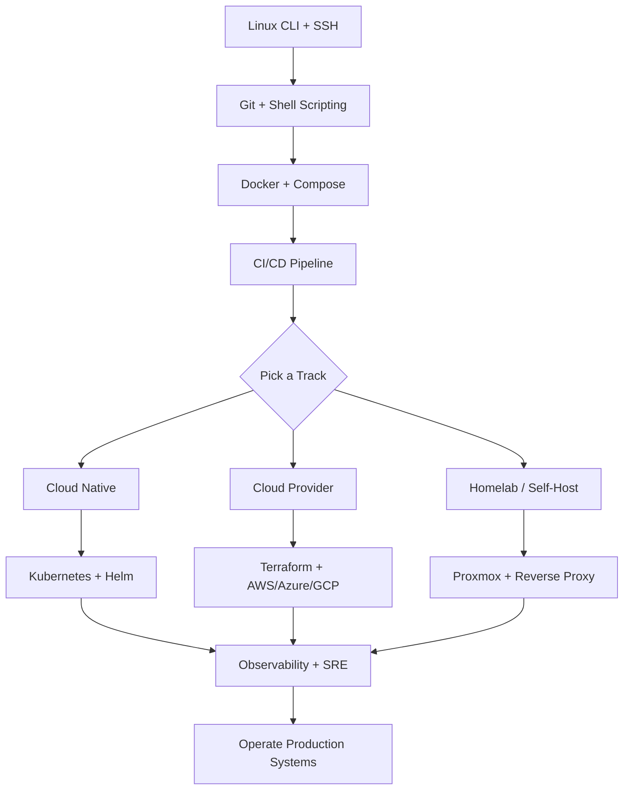

<div align="center">

# ☁️ Awesome DevOps & Cloud

**A curated guide to Linux, containers, infrastructure as code, CI/CD, cloud platforms, observability, and self-hosting — from first deploy to reliable production systems.**

[](https://github.com/sindresorhus/awesome)
[](https://github.com/kirtiramchandani/awesome-resources)
[](https://github.com/kirtiramchandani/awesome-devops-cloud/stargazers)
[](https://github.com/kirtiramchandani/awesome-devops-cloud/network/members)
[](https://github.com/kirtiramchandani/awesome-devops-cloud/pulls)
[](https://creativecommons.org/publicdomain/zero/1.0/)
[](https://github.com/kirtiramchandani/awesome-devops-cloud)

*Part of the [Awesome Resources](https://github.com/kirtiramchandani/awesome-resources) ecosystem — ship reliably, operate confidently.*

[Start Here](#-start-here) · [Why DevOps & Cloud](#-why-devops--cloud) · [Learning Path](#-learning-path) · [Linux](#-linux) · [Contributing](#-contributing)

</div>

---

## ✨ What Is This?

**Awesome DevOps & Cloud** is a standalone, topic-focused list within the [Awesome Resources](https://github.com/kirtiramchandani/awesome-resources) hub. It collects high-quality materials for building, deploying, and operating software — Linux fundamentals, containers, orchestration, infrastructure as code, CI/CD pipelines, cloud provider docs, SRE practices, monitoring, and homelab self-hosting.

| This list **is** | This list **is not** |
| --- | --- |
| 🎯 A curated map of DevOps, cloud, and platform engineering essentials | 📦 A cloud vendor sales catalog or certification dump |
| 🛤️ A learning path from shell basics to production operations | 🔍 A replacement for official provider documentation |
| 🔗 Canonical links to docs, CNCF projects, and trusted guides | 📋 An exhaustive mirror of every DevOps tool on GitHub |

> **Automate the boring parts. Observe everything. Design for failure.**

---

## 📋 Table of Contents

- [Start Here](#-start-here)
- [Why DevOps & Cloud](#-why-devops--cloud)
- [Learning Path](#-learning-path)
- [Tag Legend](#-tag-legend)
- [Linux](#-linux)
- [Docker & Containers](#-docker--containers)
- [Kubernetes & Orchestration](#-kubernetes--orchestration)
- [Infrastructure as Code](#-infrastructure-as-code)
- [CI/CD & GitHub Actions](#-cicd--github-actions)
- [AWS](#-aws)
- [Azure](#-azure)
- [Google Cloud (GCP)](#-google-cloud-gcp)
- [Site Reliability Engineering (SRE)](#-site-reliability-engineering-sre)
- [Monitoring & Observability](#-monitoring--observability)
- [Homelab & Self-Hosting](#-homelab--self-hosting)
- [Networking & Security Basics](#-networking--security-basics)
- [Books & Courses](#-books--courses)
- [Communities](#-communities)
- [Awesome Lists](#-awesome-lists)
- [Career](#-career)
- [Contributing](#-contributing)
- [License](#-license)

---

## 🚀 Start Here

Match your situation to a starting point. Each row links to a section in this README — open only what you need today.

| If you are… | Start with | Why |
| --- | --- | --- |
| 🆕 **New to Linux and servers** | [Linux](#-linux) → [Docker & Containers](#-docker--containers) | Shell fluency and container basics unlock everything else in this domain |
| 🐳 **Containerizing an app** | [Docker & Containers](#-docker--containers) | Package once, run consistently from laptop to production |
| ☸️ **Running workloads at scale** | [Kubernetes & Orchestration](#-kubernetes--orchestration) | Orchestration, service discovery, and rolling updates for distributed systems |
| 🏗️ **Managing cloud infrastructure** | [Infrastructure as Code](#-infrastructure-as-code) → [AWS](#-aws) / [Azure](#-azure) / [GCP](#-google-cloud-gcp) | Reproducible environments beat click-ops in every team beyond solo projects |
| 🔄 **Automating builds and deploys** | [CI/CD & GitHub Actions](#-cicd--github-actions) | Pipelines catch bugs early and remove manual release toil |
| 📊 **Improving reliability and uptime** | [Site Reliability Engineering (SRE)](#-site-reliability-engineering-sre) → [Monitoring & Observability](#-monitoring--observability) | You cannot improve what you do not measure |
| 🏠 **Building a homelab** | [Homelab & Self-Hosting](#-homelab--self-hosting) | Learn production concepts on hardware you control |
| 🗺️ **Want a structured roadmap** | [Learning Path](#-learning-path) | Follow the staged path below from fundamentals to specialization |

**Hub navigation:** When your focus shifts beyond operations — languages, system design, security — return to the [Awesome Resources hub](https://github.com/kirtiramchandani/awesome-resources).

---

## ☁️ Why DevOps & Cloud

Modern software delivery treats infrastructure as software: versioned, tested, automated, and observable. DevOps and cloud skills sit at the intersection of development and operations — the people who make deployments boring (in a good way).

### Strengths of this discipline

| Strength | What it means in practice |
| --- | --- |
| **Repeatability** | IaC and CI/CD mean environments are rebuilt from code, not tribal knowledge |
| **Scalability** | Cloud and Kubernetes let you scale horizontally when traffic spikes |
| **Resilience** | Health checks, autoscaling, and multi-AZ design reduce single-point failures |
| **Visibility** | Metrics, logs, and traces shorten mean time to detection and recovery |
| **Cost control** | Right-sizing, spot instances, and autoscaling down save money when done deliberately |

### Common role paths

```
Platform engineer     →  Kubernetes, Terraform, internal developer platforms
DevOps engineer       →  CI/CD, IaC, cloud networking, release automation
SRE                   →  SLOs, incident response, capacity planning, on-call
Cloud architect       →  Multi-service design, Well-Architected reviews, cost governance
Homelab enthusiast    →  Proxmox, self-hosted services, networking, backups
```

DevOps is not a single tool — it is a practice of shipping small changes frequently, automating toil, and designing systems that fail gracefully.

---

## 🛤️ Learning Path

Follow one stage at a time. Run everything in a personal lab or free-tier cloud account before touching production.

### Path diagram



### Staged roadmap

| Stage | Focus | Time estimate | Key resources in this list |
| --- | --- | --- | --- |
| **0 — Linux fluency** | Shell, files, processes, permissions, SSH | 1–2 weeks | [Linux](#-linux) |
| **1 — Containers** | Docker images, Dockerfile, Compose, registries | 2–3 weeks | [Docker & Containers](#-docker--containers) |
| **2 — Automation** | CI/CD basics, GitHub Actions, scripted deploys | 2–3 weeks | [CI/CD & GitHub Actions](#-cicd--github-actions) |
| **3 — Infrastructure** | Terraform, cloud console fundamentals, networking | 4–6 weeks | [Infrastructure as Code](#-infrastructure-as-code), cloud sections |
| **4 — Orchestration (optional)** | Kubernetes concepts, deployments, services, ingress | 4–8 weeks | [Kubernetes & Orchestration](#-kubernetes--orchestration) |
| **5 — Operations** | Monitoring, SLOs, incident response, cost review | ongoing | [SRE](#-site-reliability-engineering-sre), [Monitoring](#-monitoring--observability) |

### Track-specific forks

| Track | After Stage 2, prioritize | Capstone project idea |
| --- | --- | --- |
| **Cloud engineer** | Terraform, one cloud provider, VPC/networking | Deploy a three-tier app with IaC, CI/CD, and HTTPS |
| **Platform / K8s** | Kubernetes, Helm, GitOps | Run a containerized API on a cluster with autoscaling and ingress |
| **SRE** | Prometheus, Grafana, SLO design, runbooks | Define SLOs for a service and build dashboards plus alert rules |
| **Homelab builder** | Proxmox or bare metal, reverse proxy, backups | Self-host three services with TLS, DNS, and automated snapshots |

---

## 🏷️ Tag Legend

Tags appear in the **Tags** column of every resource table. Combine them to scan quickly for fit.

| Tag | Meaning |
| --- | --- |
| 🟢 | Beginner-friendly — minimal prerequisites |
| 🟡 | Intermediate — assumes comfortable CLI and basic networking |
| 🔴 | Advanced — production-scale or deep internals |
| 🆓 | Free to access |
| 💰 | Paid or primarily paid |
| 🛠 | Hands-on — labs, tutorials, or project work |
| 📘 | Theory-heavy — concepts, architecture, reference |
| 🚀 | Project-based — build or deploy something end-to-end |
| ⭐ | Must-read — widely recommended anchor resource |
| 🔥 | Popular — large community adoption or high traffic |
| 🌐 | Official source — maintained by project or cloud vendor |
| 📦 | Open source — source code freely available |
| ☁ | Cloud provider documentation or service |

**Level column values:** `Beginner`, `Intermediate`, `Advanced`  
**Cost column values:** `Free`, `Paid`, `Freemium`, `Open Source`

---

## 🐧 Linux

Every cloud instance, container host, and homelab server runs Linux underneath. Comfort on the command line pays dividends across every other section.

| Resource | Type | Level | Cost | Why it matters | Tags |
| --- | --- | --- | --- | --- | --- |
| [Linux Journey](https://linuxjourney.com/) | Interactive guide | Beginner | Free | Friendly tour of the filesystem, permissions, processes, and packages — ideal first Linux resource. | 🟢 🆓 🛠 ⭐ |
| [The Linux Command Line (William Shotts)](https://linuxcommand.org/tlcl.php) | Book | Beginner | Free | Thorough introduction to the shell, scripting, and system concepts — download the free PDF or buy the print edition. | 🟢 🆓 📘 ⭐ |
| [Linux man pages — man7.org](https://man7.org/linux/man-pages/) | Reference | Intermediate | Free | Authoritative syscall and command documentation — learn to read `man` pages early. | 🟡 🆓 🌐 📘 |
| [tldr pages](https://tldr.sh/) | Cheat sheets | Beginner | Open Source | Practical command examples without reading full man pages — install the CLI for daily use. | 🟢 📦 🛠 🔥 |
| [DigitalOcean — Linux Tutorials](https://www.digitalocean.com/community/tutorials?subtype=linux) | Tutorials | Beginner | Free | Step-by-step guides for users, SSH, systemd, and common admin tasks — clear writing for self-hosters. | 🟢 🆓 🛠 |
| [Linux Foundation — Free Courses](https://training.linuxfoundation.org/free-linux-training/) | Courses | Beginner | Free | Introductory courses from the organization behind the kernel — good credibility for resume building. | 🟢 🆓 🌐 |
| [Bash scripting guide — Greg's Wiki](https://mywiki.wooledge.org/BashGuide) | Guide | Intermediate | Free | Idiomatic Bash patterns for automation scripts in CI and server provisioning. | 🟡 🆓 📘 |

---

## 🐳 Docker & Containers

Containers package applications with dependencies for consistent execution across environments.

| Resource | Type | Level | Cost | Why it matters | Tags |
| --- | --- | --- | --- | --- | --- |
| [Docker Documentation](https://docs.docker.com/) | Documentation | Beginner | Free | Official guides for images, containers, networking, and volumes — start with "Get Started." | 🟢 🆓 🌐 ⭐ 🔥 |
| [Docker Compose Documentation](https://docs.docker.com/compose/) | Documentation | Intermediate | Free | Multi-container local stacks defined in YAML — the fastest path from Dockerfile to running app + database. | 🟡 🆓 🌐 ⭐ |
| [Play with Docker](https://labs.play-with-docker.com/) | Lab | Beginner | Free | Browser-based Docker playground — no local install required for first experiments. | 🟢 🆓 🛠 🚀 |
| [Dockerfile Best Practices](https://docs.docker.com/develop/develop-images/dockerfile_best-practices/) | Guide | Intermediate | Free | Layer caching, multi-stage builds, and minimal base images — avoid bloated production images. | 🟡 🆓 🌐 ⭐ |
| [Distroless Container Images (Google)](https://github.com/GoogleContainerTools/distroless) | Base images | Advanced | Open Source | Minimal runtime images without shells — reduces attack surface for production workloads. | 🔴 📦 🛡 |
| [Container Handbook (freeCodeCamp)](https://www.freecodecamp.org/news/the-docker-handbook/) | Tutorial | Beginner | Free | Long-form walkthrough covering core Docker concepts in one sitting. | 🟢 🆓 🛠 |
| [Podman Documentation](https://docs.podman.io/) | Documentation | Intermediate | Free | Daemonless container engine compatible with Docker CLI — popular on rootless and RHEL-based systems. | 🟡 🆓 🌐 📦 |

---

## ☸️ Kubernetes & Orchestration

Kubernetes orchestrates containerized workloads across clusters — the de facto standard for cloud-native platforms.

| Resource | Type | Level | Cost | Why it matters | Tags |
| --- | --- | --- | --- | --- | --- |
| [Kubernetes Documentation](https://kubernetes.io/docs/home/) | Documentation | Intermediate | Free | Official concepts, tutorials, and task guides — read "Concepts" before jumping to Helm or operators. | 🟡 🆓 🌐 ⭐ 🔥 |
| [Kubernetes The Hard Way (Kelsey Hightower)](https://github.com/kelseyhightower/kubernetes-the-hard-way) | Tutorial | Advanced | Free | Manual cluster bootstrap that teaches what managed services abstract away — invaluable for interviews and debugging. | 🔴 🆓 🛠 📘 ⭐ |
| [CNCF Landscape](https://landscape.cncf.io/) | Reference | Intermediate | Free | Interactive map of cloud-native projects — understand the ecosystem without adopting every tool. | 🟡 🆓 🌐 📘 🔥 |
| [Helm Documentation](https://helm.sh/docs/) | Tool docs | Intermediate | Free | Package manager for Kubernetes — templated manifests and release lifecycle for repeatable deploys. | 🟡 🆓 🌐 ⭐ |
| [minikube](https://minikube.sigs.k8s.io/docs/) | Local cluster | Beginner | Open Source | Single-node local Kubernetes for learning — pairs with official tutorials on your laptop. | 🟢 📦 🛠 🚀 |
| [kind — Kubernetes in Docker](https://kind.sigs.k8s.io/) | Local cluster | Intermediate | Open Source | Multi-node clusters in Docker containers — popular for CI testing and local development. | 🟡 📦 🛠 |
| [Argo CD Documentation](https://argo-cd.readthedocs.io/) | GitOps tool | Advanced | Open Source | Declarative continuous delivery for Kubernetes — sync cluster state from Git repos automatically. | 🔴 📦 🚀 ⭐ |

---

## 🏗️ Infrastructure as Code

Define infrastructure in version-controlled files instead of manual console clicks.

| Resource | Type | Level | Cost | Why it matters | Tags |
| --- | --- | --- | --- | --- | --- |
| [Terraform Documentation](https://developer.hashicorp.com/terraform/docs) | Documentation | Intermediate | Free | Industry-standard IaC tool with provider ecosystem for AWS, Azure, GCP, and hundreds of services. | 🟡 🆓 🌐 ⭐ 🔥 |
| [HashiCorp Learn — Terraform](https://developer.hashicorp.com/terraform/tutorials) | Tutorials | Beginner | Free | Guided labs from first `terraform init` to modules and remote state — best on-ramp for Terraform. | 🟢 🆓 🌐 🛠 ⭐ |
| [OpenTofu Documentation](https://opentofu.org/docs/) | Documentation | Intermediate | Open Source | Open-source Terraform fork — same workflow with community-driven governance; know it exists for vendor evaluation. | 🟡 🆓 📦 |
| [Ansible Documentation](https://docs.ansible.com/) | Documentation | Intermediate | Free | Agentless configuration management over SSH — complements Terraform for post-provision setup. | 🟡 🆓 🌐 ⭐ |
| [Pulumi Documentation](https://www.pulumi.com/docs/) | Documentation | Intermediate | Freemium | IaC in general-purpose languages (TypeScript, Python, Go) — appealing when HCL feels limiting. | 🟡 🆓 💰 |
| [Packer Documentation](https://developer.hashicorp.com/packer/docs) | Documentation | Intermediate | Free | Build machine images across cloud providers — golden AMI patterns for immutable infrastructure. | 🟡 🆓 🌐 |
| [Terragrunt Documentation](https://terragrunt.gruntwork.io/docs/) | Tool | Advanced | Open Source | Thin wrapper for Terraform DRY configs, remote state, and multi-environment workflows at scale. | 🔴 📦 |

---

## 🔄 CI/CD & GitHub Actions

Continuous integration and delivery automate testing and deployment — reducing manual release risk.

| Resource | Type | Level | Cost | Why it matters | Tags |
| --- | --- | --- | --- | --- | --- |
| [GitHub Actions Documentation](https://docs.github.com/en/actions) | Documentation | Beginner | Free | Native CI/CD for GitHub repos — YAML workflows for test, build, and deploy on every push. | 🟢 🆓 🌐 ⭐ 🔥 |
| [GitHub Actions — Starter Workflows](https://github.com/actions/starter-workflows) | Templates | Beginner | Open Source | Official workflow templates for Node, Python, Docker, and deployment targets — copy and adapt. | 🟢 📦 🚀 |
| [GitLab CI/CD Documentation](https://docs.gitlab.com/ee/ci/) | Documentation | Intermediate | Free | Integrated pipelines with `.gitlab-ci.yml` — strong option for self-hosted GitLab homelabs. | 🟡 🆓 🌐 |
| [Jenkins Documentation](https://www.jenkins.io/doc/) | Documentation | Intermediate | Open Source | Mature extensible automation server — still common in enterprises with existing plugin investments. | 🟡 📦 🔥 |
| [CircleCI Documentation](https://circleci.com/docs/) | Documentation | Intermediate | Freemium | Cloud CI with strong Docker support — alternative when GitHub Actions limits are hit. | 🟡 🆓 💰 |
| [Dagger Documentation](https://docs.dagger.io/) | Tool | Advanced | Open Source | Portable CI/CD pipelines as code that run locally or in any CI — interesting for reproducible builds. | 🔴 📦 |
| [Continuous Delivery (Jez Humble site)](https://continuousdelivery.com/) | Book / Principles | Intermediate | Paid | Foundational text on deployment pipelines, feature flags, and release engineering culture. | 🟡 💰 📘 ⭐ |

---

## 🟠 AWS

Amazon Web Services is the largest cloud provider — these are the canonical starting points for learning and architecting on AWS.

| Resource | Type | Level | Cost | Why it matters | Tags |
| --- | --- | --- | --- | --- | --- |
| [AWS Documentation](https://docs.aws.amazon.com/) | Documentation | Beginner | Free | Official reference for every AWS service — bookmark the services you use; search beats memorization. | 🟢 🆓 ☁ 🌐 ⭐ 🔥 |
| [AWS Well-Architected Framework](https://aws.amazon.com/architecture/well-architected/) | Framework | Intermediate | Free | Pillars for operational excellence, security, reliability, performance, and cost — structure for design reviews. | 🟡 🆓 ☁ ⭐ |
| [AWS Free Tier](https://aws.amazon.com/free/) | Program | Beginner | Free | 12-month and always-free services for learning — set billing alerts before experimenting. | 🟢 🆓 ☁ 🛠 |
| [AWS Skill Builder](https://skillbuilder.aws/) | Courses | Beginner | Freemium | Official training including free digital courses — pair with hands-on labs in your own account. | 🟢 🆓 💰 ☁ |
| [Amazon EC2 User Guide](https://docs.aws.amazon.com/AWSEC2/latest/UserGuide/) | Documentation | Beginner | Free | Virtual machines — the first compute service most learners touch after creating an account. | 🟢 🆓 ☁ 🌐 |
| [Amazon S3 User Guide](https://docs.aws.amazon.com/AmazonS3/latest/userguide/) | Documentation | Beginner | Free | Object storage fundamentals — static assets, backups, and data lake building blocks. | 🟢 🆓 ☁ 🌐 ⭐ |

---

## 🔵 Azure

Microsoft Azure integrates deeply with enterprise Active Directory and Microsoft tooling.

| Resource | Type | Level | Cost | Why it matters | Tags |
| --- | --- | --- | --- | --- | --- |
| [Microsoft Azure Documentation](https://learn.microsoft.com/en-us/azure/) | Documentation | Beginner | Free | Official Azure docs on Microsoft Learn — unified portal for services, tutorials, and reference. | 🟢 🆓 ☁ 🌐 ⭐ 🔥 |
| [Azure Architecture Center](https://learn.microsoft.com/en-us/azure/architecture/) | Reference | Intermediate | Free | Reference architectures, best practices, and design patterns for common Azure workloads. | 🟡 🆓 ☁ ⭐ |
| [Azure Free Account](https://azure.microsoft.com/en-us/free/) | Program | Beginner | Free | Credit and always-free services for new accounts — sufficient for certification lab practice. | 🟢 🆓 ☁ 🛠 |
| [Microsoft Learn — Azure Paths](https://learn.microsoft.com/en-us/training/azure/) | Courses | Beginner | Free | Modular learning paths aligned to role-based certifications — structured progression through services. | 🟢 🆓 ☁ 🛠 |
| [Azure CLI Documentation](https://learn.microsoft.com/en-us/cli/azure/) | Tool docs | Intermediate | Free | Scriptable Azure management from terminal — essential for automation alongside Terraform or Bicep. | 🟡 🆓 ☁ 🌐 |

---

## 🟢 Google Cloud (GCP)

Google Cloud Platform emphasizes data, Kubernetes (GKE), and global networking.

| Resource | Type | Level | Cost | Why it matters | Tags |
| --- | --- | --- | --- | --- | --- |
| [Google Cloud Documentation](https://cloud.google.com/docs) | Documentation | Beginner | Free | Official docs for Compute Engine, GKE, Cloud Storage, and the full GCP catalog. | 🟢 🆓 ☁ 🌐 ⭐ 🔥 |
| [Google Cloud Free Program](https://cloud.google.com/free) | Program | Beginner | Free | Free tier and trial credits — run small GKE clusters or Cloud Run services within limits. | 🟢 🆓 ☁ 🛠 |
| [Google Cloud Skills Boost](https://www.cloudskillsboost.google/) | Labs | Beginner | Freemium | Quest-based labs with temporary GCP credentials — hands-on without configuring your own project first. | 🟢 🆓 💰 ☁ 🛠 |
| [Google Cloud Architecture Framework](https://cloud.google.com/architecture/framework) | Framework | Intermediate | Free | Reliability, security, cost, and performance guidance from Google's SRE heritage. | 🟡 🆓 ☁ ⭐ |
| [Cloud Run Documentation](https://cloud.google.com/run/docs) | Documentation | Intermediate | Free | Serverless containers without managing Kubernetes — fast path from Docker image to HTTPS endpoint. | 🟡 🆓 ☁ 🚀 |

---

## 📈 Site Reliability Engineering (SRE)

SRE applies software engineering to operations — reliability targets, error budgets, and toil reduction.

| Resource | Type | Level | Cost | Why it matters | Tags |
| --- | --- | --- | --- | --- | --- |
| [Google SRE Books (free online)](https://sre.google/books/) | Books | Intermediate | Free | Canonical texts on SLOs, on-call, postmortems, and organizational design — read Site Reliability Engineering first. | 🟡 🆓 📘 ⭐ 🔥 |
| [Google SRE Workbook](https://sre.google/workbook/table-of-contents/) | Book | Intermediate | Free | Practical exercises implementing SRE practices — complements the first book with actionable chapters. | 🟡 🆓 📘 ⭐ |
| [The Twelve-Factor App](https://12factor.net/) | Methodology | Beginner | Free | Principles for portable, scalable SaaS apps — still relevant for cloud-native design decisions. | 🟢 🆓 📘 ⭐ |
| [Production Ready (O'Reilly summary)](https://www.oreilly.com/library/view/production-ready/9781491960200/) | Book | Advanced | Paid | Microservices checklist covering observability, deployment, and security before going live. | 🔴 💰 📘 |
| [Incident Response Guide — PagerDuty](https://response.pagerduty.com/) | Guide | Intermediate | Free | Open guide to incident command, communication, and post-incident review — useful template for on-call teams. | 🟡 🆓 📘 🛠 |

---

## 📊 Monitoring & Observability

Metrics, logs, and traces tell you whether systems are healthy and where failures originate.

| Resource | Type | Level | Cost | Why it matters | Tags |
| --- | --- | --- | --- | --- | --- |
| [Prometheus Documentation](https://prometheus.io/docs/introduction/overview/) | Documentation | Intermediate | Open Source | Pull-based metrics and PromQL — foundation of the CNCF observability stack. | 🟡 📦 ⭐ 🔥 |
| [Grafana Documentation](https://grafana.com/docs/grafana/latest/) | Documentation | Intermediate | Open Source | Visualization and dashboards for Prometheus, Loki, and dozens of data sources. | 🟡 📦 ⭐ 🔥 |
| [OpenTelemetry Documentation](https://opentelemetry.io/docs/) | Documentation | Intermediate | Open Source | Vendor-neutral instrumentation for traces, metrics, and logs — emerging standard for new services. | 🟡 📦 ⭐ |
| [Elastic — Observability Guide](https://www.elastic.co/guide/en/observability/current/index.html) | Documentation | Intermediate | Open Source | ELK stack for log aggregation and APM — common enterprise choice for centralized logging. | 🟡 📦 🔥 |
| [Loki Documentation (Grafana Labs)](https://grafana.com/docs/loki/latest/) | Documentation | Intermediate | Open Source | Log aggregation inspired by Prometheus labels — pairs with Grafana for cost-efficient logging. | 🟡 📦 |
| [Jaeger Documentation](https://www.jaegertracing.io/docs/) | Documentation | Advanced | Open Source | Distributed tracing for microservices — follow requests across service boundaries. | 🔴 📦 📘 |
| [Uptime Kuma](https://github.com/louislam/uptime-kuma) | Tool | Beginner | Open Source | Self-hosted uptime monitoring with status pages — perfect homelab entry to observability. | 🟢 📦 🛠 🚀 |

---

## 🏠 Homelab & Self-Hosting

Run production-like services on hardware you own — the best sandbox for learning networking, storage, and backups.

| Resource | Type | Level | Cost | Why it matters | Tags |
| --- | --- | --- | --- | --- | --- |
| [Awesome Self-Hosted](https://github.com/awesome-selfhosted/awesome-selfhosted) | Awesome list | Beginner | Free | Massive catalog of self-hostable applications with license and platform tags — primary discovery index for homelabbers. | 🟢 🆓 📦 ⭐ 🔥 |
| [r/homelab Wiki](https://www.reddit.com/r/homelab/wiki/index/) | Community wiki | Beginner | Free | Getting-started guides, hardware recommendations, and common pitfalls from an active community. | 🟢 🆓 🛠 |
| [Proxmox VE Documentation](https://pve.proxmox.com/wiki/Main_Page) | Documentation | Intermediate | Free | Type-1 hypervisor for VMs and LXC containers — popular homelab foundation for running multiple services. | 🟡 🆓 📦 ⭐ |
| [Traefik Documentation](https://doc.traefik.io/traefik/) | Documentation | Intermediate | Open Source | Reverse proxy with automatic TLS via Let's Encrypt — simplifies routing to multiple homelab services. | 🟡 📦 🛠 ⭐ |
| [Cloudflare DNS Documentation](https://developers.cloudflare.com/dns/) | Documentation | Beginner | Free | DNS management and optional tunnel for exposing homelab services without port forwarding. | 🟢 🆓 🌐 🛠 |
| [Pi-hole Documentation](https://docs.pi-hole.net/) | Documentation | Beginner | Open Source | Network-wide ad blocking via DNS — common first homelab service that teaches DNS fundamentals. | 🟢 📦 🛠 🚀 |
| [Restic Documentation](https://restic.readthedocs.io/) | Tool docs | Intermediate | Open Source | Encrypted, deduplicated backups to local or cloud storage — non-negotiable habit for any homelab. | 🟡 📦 🛡 ⭐ |

---

## 🔒 Networking & Security Basics

DevOps engineers need enough networking and security to configure firewalls, TLS, and least-privilege IAM without becoming full-time security specialists.

| Resource | Type | Level | Cost | Why it matters | Tags |
| --- | --- | --- | --- | --- | --- |
| [Cloudflare Learning Center — DNS](https://www.cloudflare.com/learning/dns/what-is-dns/) | Guide | Beginner | Free | Plain-language DNS explanation — prerequisite for domains, ingress, and service discovery. | 🟢 🆓 📘 |
| [Let's Encrypt Documentation](https://letsencrypt.org/docs/) | Documentation | Beginner | Free | Free TLS certificates — every public service should use HTTPS; this is the default path. | 🟢 🆓 🌐 ⭐ |
| [Mozilla SSL Configuration Generator](https://ssl-config.mozilla.org/) | Tool | Intermediate | Free | Safe TLS cipher suites for nginx, Apache, and load balancers — avoid outdated configurations. | 🟡 🆓 🛠 🛡 |
| [AWS IAM Best Practices](https://docs.aws.amazon.com/IAM/latest/UserGuide/best-practices.html) | Guide | Intermediate | Free | Least privilege, MFA, and role-based access — apply the same principles on every cloud. | 🟡 🆓 ☁ 🛡 ⭐ |
| [CIS Benchmarks (consensus secure configuration)](https://www.cisecurity.org/cis-benchmarks) | Hardening guides | Advanced | Freemium | Community-hardened configs for Linux, Docker, Kubernetes, and cloud services. | 🔴 🆓 💰 🛡 |

---

## 📚 Books & Courses

Long-form material for depth beyond documentation and quickstarts.

| Resource | Type | Level | Cost | Why it matters | Tags |
| --- | --- | --- | --- | --- | --- |
| [The Phoenix Project (Kim, Behr, Spafford)](https://itrevolution.com/product/the-phoenix-project/) | Novel | Beginner | Paid | Business fable introducing DevOps principles — readable entry point for non-technical stakeholders too. | 🟢 💰 📘 ⭐ |
| [The DevOps Handbook](https://itrevolution.com/product/the-devops-handbook/) | Book | Intermediate | Paid | Practical companion to Phoenix Project — three ways of working and technical practices in detail. | 🟡 💰 📘 ⭐ |
| [KodeKloud — DevOps Courses](https://kodekloud.com/) | Courses | Beginner | Paid | Hands-on labs for Linux, Docker, Kubernetes, and Terraform — popular for certification prep. | 🟢 💰 🛠 🔥 |
| [A Cloud Guru / Pluralsight Cloud Courses](https://www.pluralsight.com/cloud) | Courses | Intermediate | Paid | Structured cloud learning paths for AWS, Azure, and GCP with sandbox environments. | 🟡 💰 ☁ |
| [Exercism — Bash Track](https://exercism.org/tracks/bash) | Exercises | Beginner | Free | Short shell scripting exercises — builds automation fluency for CI scripts and server admin. | 🟢 🆓 🛠 |

---

## 💬 Communities

Practitioner communities for troubleshooting, tool comparisons, and career advice.

| Resource | Type | Level | Cost | Why it matters | Tags |
| --- | --- | --- | --- | --- | --- |
| [/r/devops](https://www.reddit.com/r/devops/) | Community | Intermediate | Free | Broad DevOps culture, tooling debates, and career threads — search before asking common questions. | 🟡 🆓 🔥 |
| [/r/selfhosted](https://www.reddit.com/r/selfhosted/) | Community | Beginner | Free | Homelab and self-hosting showcase — practical tips for running services at home. | 🟢 🆓 🔥 |
| [CNCF Slack](https://slack.cncf.io/) | Community | Intermediate | Free | Kubernetes and cloud-native project channels — direct access to maintainers and practitioners. | 🟡 🆓 |
| [DevOps Discord (community servers)](https://discord.com/invite/devops) | Community | Beginner | Free | Real-time help with pipelines, cloud errors, and certification study groups. | 🟢 🆓 |
| [Hacker News — DevOps threads](https://news.ycombinator.com/) | News | Advanced | Free | High-signal discussions on infrastructure trends — filter for operational war stories and postmortems. | 🔴 🆓 📘 |

---

## 📋 Awesome Lists

Discovery indexes for broader exploration. Use this README for curated essentials; use these when you need exhaustive category coverage.

| Resource | Type | Level | Cost | Why it matters | Tags |
| --- | --- | --- | --- | --- | --- |
| [sindresorhus/awesome](https://github.com/sindresorhus/awesome) | Meta-list | Beginner | Free | Original awesome-list index — starting point for finding domain-specific lists. | 🟢 🆓 📦 ⭐ 🔥 |
| [veggiemonk/awesome-docker](https://github.com/veggiemonk/awesome-docker) | Awesome list | Intermediate | Free | Deep Docker ecosystem index — complements the [Docker section](#-docker--containers) here. | 🟡 🆓 📦 |
| [ramitsurana/awesome-kubernetes](https://github.com/ramitsurana/awesome-kubernetes) | Awesome list | Intermediate | Free | Extensive Kubernetes resource catalog — use after completing official docs fundamentals. | 🟡 🆓 📦 🔥 |
| [shuaibiyy/awesome-tf](https://github.com/shuaibiyy/awesome-tf) | Awesome list | Intermediate | Free | Terraform modules, providers, and tooling roundup — discovery beyond HashiCorp Learn. | 🟡 🆓 📦 |

---

## 💼 Career

DevOps and platform roles emphasize breadth — Linux, coding, cloud, and communication under incident pressure.

| Role | Skills to emphasize | Sections to prioritize |
| --- | --- | --- |
| **DevOps engineer** | CI/CD, IaC, scripting, cloud networking | [CI/CD](#-cicd--github-actions), [IaC](#-infrastructure-as-code), cloud provider section |
| **Platform engineer** | Kubernetes, internal developer platforms, GitOps | [Kubernetes](#-kubernetes--orchestration), [SRE](#-site-reliability-engineering-sre) |
| **Cloud engineer** | AWS/Azure/GCP, Terraform, security basics | Cloud sections, [IaC](#-infrastructure-as-code), [Networking & Security](#-networking--security-basics) |
| **SRE** | SLOs, observability, incident response | [SRE](#-site-reliability-engineering-sre), [Monitoring](#-monitoring--observability) |
| **Homelab → career bridge** | Self-hosted projects as portfolio | [Homelab](#-homelab--self-hosting), document architectures publicly |

| Resource | Type | Level | Cost | Why it matters | Tags |
| --- | --- | --- | --- | --- | --- |
| [roadmap.sh — DevOps Roadmap](https://roadmap.sh/devops) | Career map | Beginner | Free | Visual skill tree connecting Linux, containers, cloud, and CI/CD — useful for gap analysis. | 🟢 🆓 ⭐ 🔥 |
| [CNCF Certifications (CKA, CKAD, CKS)](https://www.cncf.io/certification/) | Certification | Advanced | Paid | Vendor-neutral Kubernetes exams with practical clusters — respected for platform engineering roles. | 🔴 💰 🛠 ⭐ |
| [AWS Certification Paths](https://aws.amazon.com/certification/) | Certification | Intermediate | Paid | Solutions Architect and DevOps Engineer certs — common filters for cloud hiring pipelines. | 🟡 💰 ☁ |

---

## 🤝 Contributing

Contributions keep this list accurate and useful. Please read the full **[CONTRIBUTING.md](CONTRIBUTING.md)** before opening a PR.

### Quick guidelines

- **Add resources to the correct section** in this README — we do not split content across separate category files.
- **Use canonical URLs** (official docs, project homepages, primary publishers).
- **Write original descriptions** — one concise sentence explaining why the resource matters; do not copy from other awesome lists.
- **Include all table columns:** Resource, Type, Level, Cost, Why it matters, Tags.
- **No duplicates** — search the README before adding; link to an existing entry instead.
- **Quality bar:** Include resources you'd recommend to a colleague — score 4–5 on usefulness, skip promotional or affiliate-only pages.

### Contribution checklist

- [ ] Link is active and points to the canonical source
- [ ] Description is original and useful
- [ ] Category, level, cost, and tags are correct
- [ ] No duplicate of an existing entry
- [ ] Resource is DevOps, cloud, or platform-focused and high quality

---

## 📄 License

[](https://creativecommons.org/publicdomain/zero/1.0/)

This work is dedicated to the public domain under the [CC0 1.0 Universal](https://creativecommons.org/publicdomain/zero/1.0/) license.

You are free to use, modify, and distribute this content without attribution — though credit is always appreciated.

Individual linked resources maintain their own licenses. Always check the source before reusing content.

---

<div align="center">

**⭐ Star this repo if it helped you. Upstream PRs welcome.**

*Curated for engineers who ship reliably and operate with confidence.*

[⬆ Back to top](#-awesome-devops--cloud) · [🌐 Awesome Resources Hub](https://github.com/kirtiramchandani/awesome-resources)

</div>
